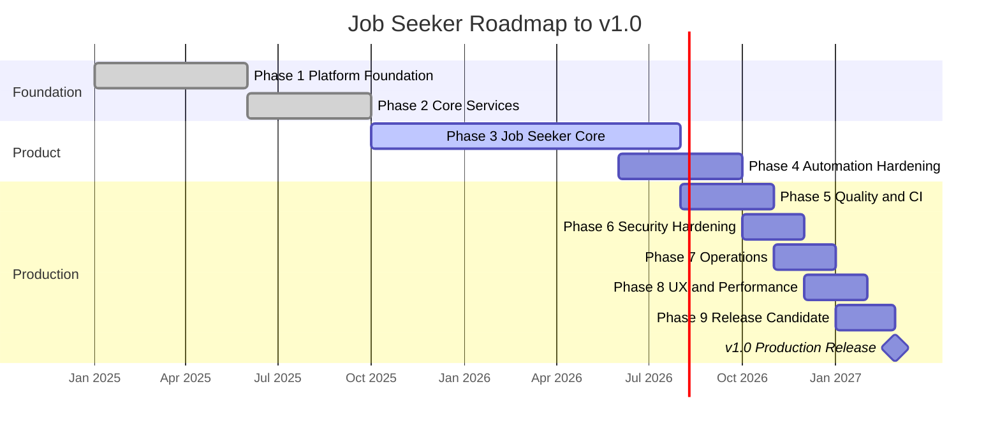
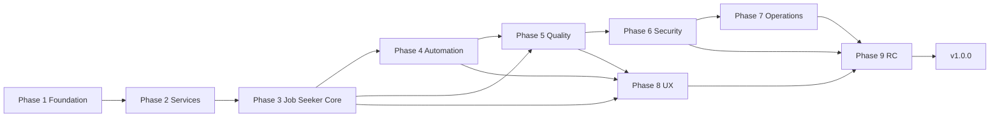

# Roadmap

Path from the current pre-release build to **v1.0.0 — Production Ready**.

This roadmap supersedes the generic CRM boilerplate phases in [`version.py`](version.py). Update this file as work completes and keep `version.py` in sync at each phase boundary.

| | |
|---|---|
| **Current version** | `0.2.0` (see `version.py`) |
| **Current phase** | Phase 3 — Job Seeker Core (`IN_PROGRESS`) |
| **Last completed** | Phase 2 — Core Services (`v0.2.0`, 2026-07-04) |
| **Git tags** | `v0.1.0`, `v0.2.0` (Phase 3 not tagged until exit criteria met) |
| **Target release** | `1.0.0` |
| **Last updated** | 2026-07-09 |

---

## Table of contents

1. [Release criteria](#release-criteria-v100)
2. [Current state snapshot](#current-state-snapshot)
3. [Production blockers](#production-blockers)
4. [Phase overview](#phase-overview)
5. [Phase 1–2 — Foundation](#phase-1--platform-foundation) (complete)
6. [Phase 3 — Job seeker core](#phase-3--job-seeker-core) (active)
7. [Phase 4 — Automation hardening](#phase-4--automation-hardening)
8. [Phase 5 — Quality and CI](#phase-5--quality-and-ci)
9. [Phase 6 — Security hardening](#phase-6--security-hardening)
10. [Phase 7 — Operations and data](#phase-7--operations-and-data)
11. [Phase 8 — UX and performance](#phase-8--ux-performance-and-polish)
12. [Phase 9 — Release candidate](#phase-9--release-candidate)
13. [v1.0.0 — Production release](#v100--production-release)
14. [Test coverage matrix](#test-coverage-matrix)
15. [Risk register](#risk-register)
16. [Open decisions](#open-decisions)
17. [Post-1.0 backlog](#post-10-backlog)
18. [How to use this roadmap](#how-to-use-this-roadmap)

---

## Release criteria (v1.0.0)

All must be true before tagging `v1.0.0`:

| # | Area | Criteria | Verified by |
|---|------|----------|-------------|
| R1 | **Core workflow** | Upload → discover → tailor → approve → download → mark applied works without automation | E2E smoke test + manual QA |
| R2 | **Automation** | Optional scraping and batch auto-apply stable behind admin flags and daily caps | Staging soak 48h |
| R3 | **Data** | PostgreSQL schema via versioned migrations; backup/restore tested | Restore drill |
| R4 | **Security** | No default secrets; credentials encrypted; HTTPS; RBAC reviewed | Security checklist |
| R5 | **Quality** | CI green on every PR; critical paths have integration tests | GitHub Actions |
| R6 | **Operations** | Docker deploy &lt; 1 hour; health checks; logging; optional Sentry | Deploy runbook |
| R7 | **Documentation** | User/admin/dev docs match code; known limitations published | Doc audit |
| R8 | **Legal** | Apache 2.0 LICENSE present; portal ToS risks documented | Legal review (self) |

---

## Current state snapshot

### Feature completeness matrix

Legend: ✅ Complete · 🟡 Partial · ❌ Missing · 🚫 Stub / not functional

#### Resume module (`app/modules/resume/`)

| Feature | Status | Key files | Gap |
|---------|--------|-----------|-----|
| PDF/DOCX upload + parse | ✅ | `resume_parser_service.py`, `routes.py` | Edge-case PDFs untested |
| Manual profile CRUD | ✅ | `profile_form_service.py`, templates | — |
| ATS DOCX export | ✅ | `resume_export_service.py` | — |
| ATS parse-test | ✅ | `resume_export_service.py` | — |
| Parser unit tests | ❌ | — | No `test_resume_parser_service.py` |
| REST API | ✅ | `resume/api.py` | — |

#### Jobs module (`app/modules/jobs/`)

| Feature | Status | Key files | Gap |
|---------|--------|-----------|-----|
| Manual postings | ✅ | `routes.py`, `api.py` | — |
| URL fetch | ✅ | `job_discovery_service.py` | Quality varies by site |
| RSS discovery | ✅ | `discovery/rss_connector.py` | Untested |
| Search profiles | ✅ | `JobSearchProfile` model, routes | — |
| Discovery inbox | ✅ | `discovery_orchestrator.py` | — |
| Keyword analysis | ✅ | `keyword_service.py` | Untested; tuning needed |
| Posting DELETE | ❌ | — | No route or API |
| Company blocklist UI | ❌ | `CompanyBlocklist` model only | Orchestrator uses it; no CRUD UI |
| Job detail enrichment | 🟡 | `job_detail_enrichment.py` | Indeed/LinkedIn fragile |
| REST API | 🟡 | `jobs/api.py` | No DELETE |

#### Discovery connectors (`app/services/discovery/`)

| Connector | Status | Env / deps | Tests |
|-----------|--------|------------|-------|
| Greenhouse | ✅ | Board slugs in search profile | `test_connectors.py` |
| Lever | ✅ | Board slugs in search profile | `test_connectors.py` |
| Adzuna | ✅ | `ADZUNA_APP_ID/KEY` | None |
| Remotive | ✅ | None (public API) | None |
| RSS | ✅ | Feed URLs in search profile | None |
| LinkedIn | 🟡 | Credentials + `LINKEDIN_SCRAPE_ENABLED` | Parser only |
| Indeed | 🟡 | Credentials + headed Chrome | Parser only |
| Ashby | ❌ | Enum in `jobs.py` only | — |

#### Applications module (`app/modules/applications/`)

| Feature | Status | Key files | Gap |
|---------|--------|-----------|-----|
| Pipeline kanban | ✅ | `pipeline_service.py`, templates | No pagination at scale |
| Tailoring + diff review | ✅ | `tailoring_service.py`, `tailoring_diff_service.py` | — |
| Apply queue + batches | ✅ | `apply_batch_service.py` | — |
| Batch tailor (Celery) | ✅ | `job_tasks.py` | — |
| Application notes (web) | ✅ | `routes.py` | No API endpoint |
| Application DELETE | ❌ | — | — |
| Activity timeline | ✅ | `activity_service.py` | Untested |

#### Apply module (`app/modules/apply/`)

| Feature | Status | Key files | Gap |
|---------|--------|-----------|-----|
| Apply draft review | ✅ | `apply_draft_service.py`, `review.html` | — |
| Cover letter regenerate | ✅ | `llm_service.py` | OpenAI only |
| Portal credentials UI | 🟡 | `credentials.html` | Not in sidebar (`config/modules.py`) |
| Manual mark-applied | ✅ | `routes.py`, `api.py` | — |
| Single-app auto-submit | ❌ | — | No UI path to adapters |
| Batch auto-submit | 🚫 | `apply_submission_service.py` | **No adapter returns `submitted`** |

#### Apply adapters (`app/services/apply_adapters/`)

| Adapter | Status | Behavior |
|---------|--------|----------|
| Generic | 🚫 | Always `needs_manual` |
| Greenhouse | 🟡 | Playwright pre-fill + screenshot; never clicks Submit |
| Lever | 🟡 | Same as Greenhouse |
| LinkedIn | 🚫 | Credential check only; no Easy Apply automation |
| Indeed | 🚫 | Explicit stub — always `needs_manual` |
| Ashby | ❌ | Not implemented |

#### Analytics module (`app/modules/analytics/`)

| Feature | Status | Key files | Gap |
|---------|--------|-----------|-----|
| Dashboard | ✅ | `analytics_service.py` | — |
| JSON summary | 🟡 | `routes.py` `/analytics/api/summary` | Not under `/api/v1/` |
| REST API blueprint | ❌ | — | Not registered |
| Tests | ❌ | — | — |
| Follow-up reminders UI | ❌ | `follow_up_at` column exists | Celery task logs only |

#### Platform (inherited boilerplate)

| Feature | Status | Notes |
|---------|--------|-------|
| Auth (login, register, reset) | ✅ | API password reset email TODO |
| RBAC admin | ✅ | Job seeker routes lack permission checks |
| OAuth | 🟡 | Tokens stored plaintext |
| 2FA | ✅ | Optional |
| Email service | ✅ | Console default |
| Docker Compose | ✅ | web, db, redis, celery |
| CI/CD | ❌ | No `.github/workflows/` |
| Alembic migrations | ❌ | Script-based schema only |

---

## Production blockers

Issues that must be resolved before v1.0.0:

| Priority | Blocker | Phase | Owner action |
|----------|---------|-------|--------------|
| **P0** | No CI — tests not enforced on PRs | 5 | Add GitHub Actions workflow |
| **P0** | No versioned DB migrations | 7 | Alembic for `auth` + `jobs` schemas |
| **P0** | Auto-apply adapters never return `submitted` | 4 | Implement at least one real submit path |
| **P0** | `init_database.py` incomplete without `create_jobs_schema.py` | 3/7 | Document + automate or merge scripts |
| **P1** | OAuth tokens unencrypted at rest | 6 | Encrypt in `app/models/oauth.py` |
| **P1** | `CREDENTIAL_ENCRYPTION_KEY` optional — ephemeral fallback | 6 | Fail startup in production if unset |
| **P1** | Default `SECRET_KEY` / `JWT_SECRET_KEY` not rejected | 6 | Production config validation |
| **P1** | No integration/route tests | 5 | Flask test client coverage |
| **P1** | Job seeker routes have no RBAC permissions | 6 | Add permission checks or document single-user model |
| **P2** | Swagger at `/api/v1/docs/` doesn't include job seeker APIs | 5 | Register namespaces or fix docs |
| **P2** | `version.py` out of sync with roadmap | 3 | Update metadata |
| **P2** | Anthropic LLM env var checked but not implemented | 4 | Wire or remove from `is_configured()` |

---

## Phase overview



### Phase dependency graph



Phases 4 and 5 can run in parallel after Phase 3 exit. Phase 8 can start during Phase 5.

---

## Phase 1 — Platform foundation

**Version:** `0.1.0` · **Status:** ✅ Complete

| Deliverable | Status |
|-------------|--------|
| Application factory + blueprints | ✅ `app/__init__.py` |
| PostgreSQL / SQLite support | ✅ `app/extensions/database_config.py` |
| Flask-Login auth | ✅ `app/modules/auth/` |
| RBAC (roles, permissions, admin) | ✅ `app/modules/admin/`, `app/models/rbac.py` |
| OAuth (Google, MS, GitHub) | ✅ `app/services/oauth_service.py` |
| 2FA (TOTP) | ✅ `app/services/totp_service.py` |
| Vuexy UI shell | ✅ `app/templates/`, `app/static/` |

**Docs:** [docs/03-development/auth/](docs/03-development/auth/) · [docs/03-development/rbac/](docs/03-development/rbac/)

---

## Phase 2 — Core services and infrastructure

**Version:** `0.2.0` · **Status:** ✅ Complete (2026-07-04)

| Deliverable | Status |
|-------------|--------|
| REST API framework | ✅ `app/api/` |
| Swagger UI shell | 🟡 Only health namespace registered |
| Email service | ✅ `app/services/email_service.py` |
| Redis cache (optional) | ✅ |
| Celery worker/beat | ✅ `celery_app.py`, `docker-compose.yml` |
| DB backup scripts | ✅ `scripts/backup_database.py` |
| Health endpoints | ✅ `/health`, `/health/database` |
| Docker Compose stack | ✅ web, db, redis, celery_worker, celery_beat |

**Docs:** [docs/04-operations/INFRASTRUCTURE.md](docs/04-operations/INFRASTRUCTURE.md)

---

## Phase 3 — Job seeker core

**Version:** `0.3.0` · **Status:** 🟡 In progress (~85% feature-complete, stabilization needed)

**Goal:** Reliable manual job search workflow without automation.

### 3.1 Completed work

- [x] Master profile upload, parse, manual edit, activate
- [x] ATS DOCX export + parse-test harness
- [x] Job postings (manual, URL fetch, RSS)
- [x] Search profiles + multi-connector discovery
- [x] Discovery inbox (accept/skip, fit scoring)
- [x] Application pipeline kanban + stage API
- [x] Constrained tailoring + diff review UI
- [x] Apply draft pre-fill + cover letter
- [x] Apply queue + batch creation + readiness checks
- [x] Analytics dashboard (funnel, sources)
- [x] Comprehensive user/admin/dev documentation
- [x] Apache 2.0 license

### 3.2 Stabilization tasks

#### P0 — Must complete for phase exit

- [ ] **E2E manual workflow smoke test**
  - Add `tests/test_e2e_manual_workflow.py` using Flask test client
  - Flow: upload → save profile → create posting → create app → tailor → approve → save draft → mark applied
  - Files: `tests/conftest.py`, new test file

- [ ] **Database init clarity**
  - Option A: Merge `create_jobs_schema.py` into `init_database.py`
  - Option B: `init_database.py` prints warning and calls jobs schema script
  - Files: `scripts/init_database.py`, `scripts/create_jobs_schema.py`
  - Docs: [GETTING_STARTED.md](docs/01-getting-started/GETTING_STARTED.md)

- [ ] **First-run checklist passes on clean install**
  - Run through [FIRST_RUN_CHECKLIST.md](docs/01-getting-started/FIRST_RUN_CHECKLIST.md) end-to-end
  - Fix any failures found

- [ ] **All existing pytest tests pass**
  - `pytest` with no failures

#### P1 — Should complete for phase exit

- [ ] **Resume parser tests**
  - Add `tests/test_resume_parser_service.py`
  - Fixtures: simple PDF/DOCX samples in `tests/fixtures/`
  - Cover: valid parse, empty file, unsupported format

- [ ] **Keyword service tests**
  - Add `tests/test_keyword_service.py`
  - Cover: extraction, coverage score, synonym matches

- [x] **Sync `version.py`**
  - Updated `__version__`, `__phase__`, `get_roadmap()`, `is_phase_complete()`
  - Aligned with job seeker phases in this file
  - File: `version.py` (2026-07-09)
  - Note: bump to `0.3.0` and tag `v0.3.0` only when Phase 3 exit criteria are met

- [ ] **Dashboard empty states**
  - Warn when no active profile on `/` (partial — verify `main/home.html`)
  - Empty inbox, empty pipeline, empty applications list messages
  - Files: `app/templates/main/home.html`, module list templates

- [ ] **Posting DELETE**
  - `DELETE /api/v1/jobs/postings/<id>` (soft delete)
  - Web action on posting detail
  - Files: `app/modules/jobs/api.py`, `app/modules/jobs/routes.py`

- [ ] **Application soft-delete**
  - `DELETE /api/v1/applications/<id>`
  - Files: `app/modules/applications/api.py`, `routes.py`

#### P2 — Nice to have for phase exit

- [ ] **Resume parser edge cases**
  - Multi-column PDF detection warning
  - Table extraction fallback
  - File: `app/services/resume_parser_service.py`

- [ ] **Keyword tuning**
  - Review extraction for common JD formats (bullet lists, skills sections)
  - File: `app/services/keyword_service.py`

- [ ] **Link credentials page from settings**
  - Add to Account section or Applications submenu
  - File: `config/modules.py`

- [ ] **Notes API endpoint**
  - `POST /api/v1/applications/<id>/notes`
  - File: `app/modules/applications/api.py`

- [ ] **Archive legacy CRM code**
  - Move `app/modules/crm/`, unregistered `app/modules/account/` to `ARCHIVE/`
  - Update docs to note removal
  - No functional change (already unregistered)

### 3.3 Exit criteria

| # | Criterion | Status |
|---|-----------|--------|
| E3.1 | [FIRST_RUN_CHECKLIST.md](docs/01-getting-started/FIRST_RUN_CHECKLIST.md) passes | ⬜ |
| E3.2 | E2E manual workflow test passes in CI | ⬜ |
| E3.3 | `pytest` — 0 failures | ⬜ |
| E3.4 | `version.py` shows Phase 3 complete, `0.3.0` | ⬜ |
| E3.5 | No open P0 bugs in manual workflow | ⬜ |

**Estimated effort:** 2–4 weeks

---

## Phase 4 — Automation hardening

**Version:** `0.4.0` · **Status:** ⬜ Planned  
**Depends on:** Phase 3 exit  
**Goal:** Optional automation reliable enough for cautious production use.

### 4.1 Playwright and scraping

| Task | Priority | Files |
|------|----------|-------|
| LinkedIn discovery: handle security checkpoints gracefully | P0 | `browser_manager.py`, `discovery/linkedin.py` |
| Indeed discovery: enforce headed mode, retry on block | P0 | `browser_launch_args.py`, `discovery/indeed.py` |
| Job detail enrichment: retry + partial result handling | P1 | `job_detail_enrichment.py` |
| Scrape proof audit UI (view screenshots from admin) | P2 | New admin route or application detail |
| Connector tests for LinkedIn/Indeed (mocked browser) | P1 | `tests/test_linkedin_connector.py`, `tests/test_indeed_connector.py` |
| Align proof paths: `instance/scrape_proofs/` vs `instance/submission_proofs/` | P2 | Docs + code consistency |

### 4.2 Portal credentials

| Task | Priority | Files |
|------|----------|-------|
| Session expiry detection on credential test | P0 | `session_health.py`, credentials template |
| Re-auth prompt when session invalid during scrape | P0 | `browser_manager.py`, `discovery_orchestrator.py` |
| Credential health dashboard (last used, expires, status) | P1 | `app/modules/apply/routes.py`, new template section |
| Document session refresh cadence in user guide | P1 | `docs/02-user-guide/BATCH_AUTO_APPLY.md` |

### 4.3 Apply adapters — critical path

**Current state:** No adapter returns `ApplyResult(success=True, status='submitted')`. Batch auto-apply cannot complete.

| Task | Priority | Files | Target |
|------|----------|-------|--------|
| Greenhouse: complete Submit click + confirmation detection | P0 | `apply_adapters/greenhouse.py` | First `submitted` adapter |
| Lever: complete Submit click + confirmation detection | P1 | `apply_adapters/lever.py` | `submitted` |
| LinkedIn Easy Apply: multi-step form automation | P1 | `apply_adapters/linkedin.py` | `submitted` or `needs_manual` with proof |
| Indeed Apply: implement (currently explicit stub) | P2 | `apply_adapters/indeed.py` | `submitted` or `needs_manual` |
| Ashby apply adapter | P2 | New `apply_adapters/ashby.py` | `needs_manual` minimum |
| Adapter integration tests with mocked Playwright | P0 | `tests/test_apply_adapters.py` | Assert `submitted` path |
| Batch completion: handle `partial_failure` with retry UI | P1 | `apply_batch_service.py`, batch detail template |

### 4.4 Discovery expansion

| Task | Priority | Files |
|------|----------|-------|
| Ashby discovery connector | P2 | New `discovery/ashby.py`, register in `__init__.py` |
| Adzuna connector tests | P1 | `tests/test_adzuna_connector.py` |
| Remotive + RSS connector tests | P2 | `tests/test_remotive_connector.py`, `tests/test_rss_connector.py` |
| Company blocklist CRUD UI + API | P1 | New routes, `jobs/api.py`, template |
| Celery beat: verify scheduled discovery runs | P1 | `celery_config.py`, `job_tasks.py` |

### 4.5 LLM

| Task | Priority | Files |
|------|----------|-------|
| Implement Anthropic provider in `llm_service` | P2 | `app/services/llm_service.py` |
| Or: remove `ANTHROPIC_API_KEY` from `is_configured()` if not implementing | P2 | `app/services/llm_service.py` |
| LLM fallback messaging in tailoring UI when no API key | P1 | `tailoring_review.html` |

### 4.6 Safety gates (non-negotiable)

- [x] Auto-apply flags default `false` in `env.example`
- [x] Human batch approval required
- [x] `DAILY_APPLY_CAP` enforced in `apply_batch_service.py`
- [ ] Audit log entry for every automated submission
- [ ] Admin toggle to disable all automation without restart
- [ ] Scrape rate limits enforced with Redis in Docker deployments

### 4.7 Exit criteria

| # | Criterion |
|---|-----------|
| E4.1 | At least one adapter returns `submitted` in staging |
| E4.2 | Batch of 3+ Greenhouse apps completes with ≥1 `submitted` |
| E4.3 | LinkedIn/Indeed discovery runs 10 consecutive times without crash |
| E4.4 | [AUTOMATION_SETUP.md](docs/04-operations/AUTOMATION_SETUP.md) validated on Docker stack |
| E4.5 | All automation behind flags; disabling flags blocks all auto-submit |

**Estimated effort:** 4–8 weeks

---

## Phase 5 — Quality and CI

**Version:** `0.5.0` · **Status:** ⬜ Planned  
**Depends on:** Phase 3 exit (can overlap with Phase 4)

### 5.1 CI pipeline

Create `.github/workflows/ci.yml`:

```yaml
# Target jobs:
# - pytest (all tests)
# - black --check .
# - flake8 app/ tests/
# - bandit -r app/ (advisory, non-blocking initially)
```

| Task | Priority |
|------|----------|
| GitHub Actions: pytest on push/PR to `main` | P0 |
| GitHub Actions: black + flake8 | P1 |
| GitHub Actions: bandit security scan | P2 |
| Branch protection: require CI pass | P1 |
| Add CI badge to README.md | P2 |

### 5.2 Integration tests

| Endpoint group | Tests to add | File |
|----------------|--------------|------|
| Resume API | upload, save, activate, export | `tests/integration/test_resume_api.py` |
| Jobs API | create posting, run discovery, inbox accept | `tests/integration/test_jobs_api.py` |
| Applications API | create, tailor, approve, stage PATCH | `tests/integration/test_applications_api.py` |
| Apply API | save draft, create batch, approve batch | `tests/integration/test_apply_api.py` |
| Auth | login, me, logout | `tests/integration/test_auth_api.py` |

Use `tests/conftest.py` `app` + `db_session` fixtures with Flask test client.

### 5.3 Service test gaps

| Service | Test file to create |
|---------|---------------------|
| `resume_parser_service` | `tests/test_resume_parser_service.py` |
| `keyword_service` | `tests/test_keyword_service.py` |
| `analytics_service` | `tests/test_analytics_service.py` |
| `pipeline_service` | `tests/test_pipeline_service.py` |
| `apply_batch_service` | `tests/test_apply_batch_service.py` |
| `apply_submission_service` | `tests/test_apply_submission_service.py` |
| `job_discovery_service` | `tests/test_job_discovery_service.py` |
| `llm_service` | `tests/test_llm_service.py` (mock API) |

### 5.4 Coverage and regression

| Task | Priority | Target |
|------|----------|--------|
| `pytest-cov` in CI | P1 | ≥ 70% on `app/services/` |
| Tailoring constraint tests (no invented facts) | P0 | Extend `test_tailoring_validation.py` |
| ATS export rule regression tests | P1 | Extend `test_resume_export_service.py` |
| Fix `scripts/run_tests.py` (references non-existent `tests/unit/`) | P2 | `scripts/run_tests.py` |

### 5.5 API documentation accuracy

| Task | Priority |
|------|----------|
| Fix JWT auth path in docs (`/api/auth/login` not `/api/v1/auth/login`) | P1 |
| Register job seeker blueprints in Flask-RESTX OR remove Swagger claim | P1 |
| Implement or remove `app/api/documentation.py` stubs | P2 |
| Add analytics to API docs or document as web-only | P2 |

### 5.6 Exit criteria

| # | Criterion |
|---|-----------|
| E5.1 | CI green on `main` for 2 consecutive weeks |
| E5.2 | Integration tests cover manual workflow critical path |
| E5.3 | ≥ 70% coverage on `app/services/` job seeker modules |
| E5.4 | API docs match actual endpoint paths |

**Estimated effort:** 3–5 weeks

---

## Phase 6 — Security hardening

**Version:** `0.6.0` · **Status:** ⬜ Planned  
**Depends on:** Phase 5 (CI includes security scans)

### 6.1 Secrets and config validation

| Task | Priority | File |
|------|----------|------|
| Reject startup if `SECRET_KEY` is default in production | P0 | `app/extensions/config.py` |
| Reject startup if `JWT_SECRET_KEY` is default in production | P0 | `app/extensions/config.py` |
| Require `CREDENTIAL_ENCRYPTION_KEY` when automation flags enabled | P0 | `app/__init__.py` or config |
| Remove ephemeral Fernet fallback in production | P0 | `credential_vault_service.py` |
| Document secret rotation procedure | P1 | `docs/04-operations/ADMIN_GUIDE.md` |

### 6.2 OAuth and credentials

| Task | Priority | File |
|------|----------|------|
| Encrypt OAuth access/refresh tokens at rest | P0 | `app/models/oauth.py`, migration |
| Implement password reset email in auth API | P1 | `app/modules/auth/api.py` line 253 |
| OAuth token refresh automation | P2 | `app/services/oauth_service.py` |

### 6.3 Access control

| Task | Priority | Decision needed |
|------|----------|-----------------|
| Define job seeker permission model | P0 | See [Open decisions](#open-decisions) |
| Add `@permission_required` to job seeker routes OR document single-user | P0 | — |
| RBAC: implement inherited permissions from role hierarchy | P2 | `app/models/auth.py` line 104 |
| API rate limiting on job seeker endpoints | P1 | Flask-Limiter config |

### 6.4 Input and upload security

| Task | Priority |
|------|----------|
| Resume upload size limit (e.g. 10 MB) | P1 |
| File type validation beyond extension check | P1 |
| Sanitize parsed profile JSON (no script injection in templates) | P1 |
| CSRF on all job seeker POST routes (verify) | P1 |

### 6.5 Audit and compliance

| Task | Priority |
|------|----------|
| Security event logging (failed logins, permission denials) | P1 |
| Application activity timeline includes auto-submit events | P1 |
| `pip-audit` or `safety` in CI | P2 |
| Document portal ToS considerations for scraping/auto-apply | P1 |

### 6.6 Exit criteria

| # | Criterion |
|---|-----------|
| E6.1 | [ADMIN_GUIDE.md](docs/04-operations/ADMIN_GUIDE.md) production checklist complete |
| E6.2 | No high-severity bandit findings open |
| E6.3 | OAuth tokens encrypted |
| E6.4 | Production startup fails with default secrets |

**Estimated effort:** 2–4 weeks

---

## Phase 7 — Operations and data

**Version:** `0.7.0` · **Status:** ⬜ Planned  
**Depends on:** Phase 6

### 7.1 Database migrations

| Task | Priority | Notes |
|------|----------|-------|
| Initialize Alembic with `auth` + `jobs` schemas | P0 | `flask db init` |
| Generate initial migration from current models | P0 | `app/models/auth.py`, `app/models/jobs.py` |
| Migration path from script-based setup | P0 | Document upgrade from `create_jobs_schema.py` |
| Remove or deprecate `scripts/rebuild_migrations.py` (stale CRM refs) | P1 | |
| CI: `flask db upgrade` on fresh PostgreSQL | P0 | |

### 7.2 Backup and recovery

| Task | Priority |
|------|----------|
| Scheduled backup cron example in docs | P1 |
| Restore drill documented and tested | P0 |
| Backup includes `instance/scrape_proofs/` and uploads | P2 |

### 7.3 Production deployment

| Task | Priority |
|------|----------|
| Production Docker Compose overlay (`docker-compose.prod.yml`) | P1 |
| Secrets via `.env` or Docker secrets, not in compose files | P0 |
| Gunicorn + Nginx example in DEPLOYMENT.md | P1 |
| SSL/TLS termination guide | P1 |
| Celery worker health check | P1 |

### 7.4 Monitoring and observability

| Task | Priority |
|------|----------|
| Verify Sentry integration end-to-end | P1 |
| Structured JSON logging option | P2 |
| Flower for Celery monitoring (optional) | P2 |
| `/health` includes Celery worker connectivity | P1 |
| Runbooks: scrape failure, batch partial failure, DB recovery | P0 |

### 7.5 Exit criteria

| # | Criterion |
|---|-----------|
| E7.1 | Fresh production deploy from docs in &lt; 1 hour |
| E7.2 | `flask db upgrade` on empty PostgreSQL creates full schema |
| E7.3 | Backup restore drill successful |
| E7.4 | Runbooks published in `docs/04-operations/` |

**Estimated effort:** 3–5 weeks

---

## Phase 8 — UX, performance, and polish

**Version:** `0.8.0` · **Status:** ⬜ Planned  
**Depends on:** Phase 3 exit; benefits from Phase 5 + 7

### 8.1 Onboarding

| Task | Priority |
|------|----------|
| First-run wizard: profile → first job → first application | P1 |
| Progress indicator on dashboard (% setup complete) | P2 |
| Contextual help links to user guide sections | P2 |

### 8.2 Error handling and feedback

| Task | Priority | File |
|------|----------|------|
| Parser failure: actionable message + manual entry CTA | P1 | `resume/upload.html` |
| Scrape failure: explain credential/session issues | P1 | `jobs/discovery_inbox.html` |
| LLM unavailable: explain heuristic fallback | P1 | `tailoring_review.html` |
| Batch failure: per-item error with retry action | P1 | `batch_detail.html` |

### 8.3 Performance

| Task | Priority | Target |
|------|----------|--------|
| Discovery inbox pagination | P1 | 50 items/page |
| Applications list pagination | P1 | 25 items/page |
| Pipeline board: lazy-load columns with 50+ cards | P2 | |
| Keyword analysis caching per posting | P2 | |
| Dashboard load time | P1 | &lt; 2s with 100 applications |

### 8.4 Mobile and accessibility

| Task | Priority |
|------|----------|
| Responsive tailoring review tabs | P1 |
| Responsive apply review page | P1 |
| Kanban keyboard navigation | P2 |
| Form label / ARIA audit on job seeker forms | P2 |
| Color contrast check on status badges | P2 |

### 8.5 Notifications and reminders

| Task | Priority | File |
|------|----------|------|
| Follow-up reminder dashboard widget | P1 | `main/home.html`, `follow_up_at` |
| Email: discovery digest (new inbox items) | P2 | `email_tasks.py` |
| Email: batch completion summary | P2 | `job_tasks.py` |
| Email: follow-up due reminder | P2 | `job_tasks.py` (`check_follow_up_reminders` exists) |

### 8.6 Exit criteria

| # | Criterion |
|---|-----------|
| E8.1 | Core pages usable on 375px mobile viewport |
| E8.2 | Dashboard &lt; 2s with 100 applications on PostgreSQL |
| E8.3 | No raw exception traces shown to users |

**Estimated effort:** 3–5 weeks

---

## Phase 9 — Release candidate

**Version:** `0.9.0` · **Status:** ⬜ Planned  
**Depends on:** Phases 6, 7, 8

### 9.1 Release preparation

| Task | Priority |
|------|----------|
| Feature freeze — bug fixes and docs only | P0 |
| Create `CHANGELOG.md` (v0.2.0 → v0.9.0) | P0 |
| Create `CONTRIBUTING.md` | P1 |
| Upgrade guide: SQLite dev → PostgreSQL production | P0 |
| Known limitations doc section | P0 |
| Tag `v0.9.0` | P0 |

### 9.2 Quality gates

| Task | Priority |
|------|----------|
| Staging soak: 2+ weeks real usage | P0 |
| Full documentation audit (docs match code) | P0 |
| Zero open P0/P1 bugs | P0 |
| Performance baseline recorded | P1 |
| Security checklist signed off | P0 |

### 9.3 Exit criteria

| # | Criterion |
|---|-----------|
| E9.1 | Staging soak complete with no P0 incidents |
| E9.2 | Stakeholder sign-off on manual workflow |
| E9.3 | CHANGELOG complete |
| E9.4 | `v0.9.0` tagged and deployed |

**Estimated effort:** 2–3 weeks

---

## v1.0.0 — Production release

**Status:** ⬜ Planned

### Release checklist

- [ ] All Phase 9 exit criteria met
- [ ] All [Release criteria (v1.0.0)](#release-criteria-v100) (R1–R8) verified
- [ ] `version.py` updated: `__version__ = "1.0.0"`, `is_production_ready = True`
- [ ] Git tag `v1.0.0` with release notes from CHANGELOG
- [ ] Docker image tagged `1.0.0`
- [ ] README updated with production badge

### What v1.0 includes

- Complete **manual** job search workflow (no automation required)
- Optional automation (discovery scraping, batch apply) behind admin flags
- PostgreSQL + Docker deployment path
- CI, security baseline, backup/restore
- Apache 2.0 licensed

### What v1.0 explicitly does not include

- Multi-tenant SaaS billing
- Mobile native apps
- Guaranteed auto-apply success on all portals
- Workday / Taleo / iCIMS enterprise ATS
- AI interview prep
- Chrome extension

---

## Test coverage matrix

| Module / Service | Unit tests | Integration tests | Target phase |
|------------------|------------|-------------------|--------------|
| `resume_parser_service` | ❌ | ❌ | 3 |
| `resume_export_service` | ✅ | ❌ | — |
| `profile_form_service` | ✅ | ❌ | — |
| `keyword_service` | ❌ | ❌ | 3 |
| `tailoring_service` | ✅ (validation) | ❌ | — |
| `tailoring_diff_service` | ✅ | ❌ | — |
| `apply_draft_service` | ✅ | ❌ | — |
| `apply_batch_service` | ❌ | ❌ | 5 |
| `apply_submission_service` | ❌ | ❌ | 4 |
| `discovery_orchestrator` | ✅ | ❌ | — |
| `job_detail_enrichment` | ✅ | ❌ | — |
| `job_discovery_service` | ❌ | ❌ | 5 |
| `pipeline_service` | ❌ | ❌ | 5 |
| `analytics_service` | ❌ | ❌ | 5 |
| `llm_service` | ❌ | ❌ | 4/5 |
| `browser_manager` | ✅ | ❌ | — |
| `scrape_rate_limiter` | ✅ | ❌ | — |
| Greenhouse/Lever connectors | ✅ | ❌ | — |
| LinkedIn/Indeed connectors | ❌ | ❌ | 4 |
| Apply adapters | ✅ (smoke) | ❌ | 4 |
| Resume API | ❌ | ❌ | 5 |
| Jobs API | ❌ | ❌ | 5 |
| Applications API | ❌ | ❌ | 5 |
| Apply API | ❌ | ❌ | 5 |
| E2E manual workflow | ❌ | ❌ | 3 |

---

## Risk register

| ID | Risk | Likelihood | Impact | Mitigation | Phase |
|----|------|------------|--------|------------|-------|
| RK1 | LinkedIn/Indeed block scraping (ToS, captcha) | High | High | API sources primary; scraping opt-in; `needs_manual` fallback | 4 |
| RK2 | Auto-apply submits wrong data | Medium | Critical | Human approval gate; diff review; daily cap; proof screenshots | 4 |
| RK3 | Resume parser misrepresents experience | Medium | High | Human review before save; tailoring diff audit; no invented facts constraint | 3 |
| RK4 | Portal session expiry mid-batch | High | Medium | Session health checks; per-item error handling; retry UI | 4 |
| RK5 | Schema drift without migrations | High | High | Alembic migrations; CI migration test | 7 |
| RK6 | LLM API cost / rate limits | Medium | Low | Heuristic fallback; optional API key; user-visible fallback message | 3/4 |
| RK7 | Single-user app deployed multi-user | Medium | Medium | RBAC decision; permission model or document single-user | 6 |
| RK8 | Stale docs mislead users | Medium | Medium | Doc audit in Phase 9; link docs to roadmap | 9 |

---

## Open decisions

Decisions needed before or during upcoming phases:

| # | Decision | Options | Recommendation | Needed by |
|---|----------|---------|----------------|-----------|
| D1 | **Multi-user vs single-user** | (a) Full RBAC on job seeker routes (b) Document as single-user self-hosted (c) Tenant isolation | (b) for v1.0 — add RBAC in post-1.0 | Phase 6 |
| D2 | **Anthropic LLM support** | (a) Implement (b) Remove env var (c) Defer post-1.0 | (b) or (c) — OpenAI sufficient for v1.0 | Phase 4 |
| D3 | **Ashby support** | (a) Phase 4 (b) Post-1.0 | (b) — focus on Greenhouse/Lever first | Phase 4 |
| D4 | **DB init: one script or two** | (a) Merge into `init_database.py` (b) Keep separate with wrapper | (a) — reduces install errors | Phase 3 |
| D5 | **Swagger/OpenAPI** | (a) Register all blueprints in Flask-RESTX (b) Drop Swagger claim (c) OpenAPI 3 static spec | (c) — lower effort, accurate | Phase 5 |
| D6 | **Indeed auto-apply** | (a) Full automation (b) Pre-fill only, manual submit (c) Defer | (b) — Indeed blocks headless; high fragility | Phase 4 |

---

## Post-1.0 backlog

Prioritized features after v1.0.0:

### High priority

| Feature | Rationale |
|---------|-----------|
| Scheduled discovery + email digest | Celery beat exists; needs email template + UI |
| Company blocklist UI | Model + orchestrator logic done |
| LinkedIn Easy Apply full automation | High user demand |
| Multi-user RBAC for job seeker routes | If D1 chooses (a) |
| Webhook/API for integrations (Zapier, n8n) | Power users |

### Medium priority

| Feature |
|---------|
| Resume version PDF export |
| Custom application stages |
| Application templates (reuse tailoring settings) |
| Chrome extension for job capture |
| Ashby connector + adapter |
| Anthropic / multi-LLM provider support |
| Interview prep / mock questions |

### Low priority

| Feature |
|---------|
| Multiple active profiles (technical vs management) |
| Team mode (coach reviews candidate apps) |
| Multi-tenant SaaS billing |
| Mobile native app |
| Workday / Taleo integrations |

---

## How to use this roadmap

### For developers

1. Find the **current phase** (Phase 3) and pick a task by priority (P0 first)
2. Check **file paths** in the task table
3. Complete tasks and check the box `[x]`
4. When all **exit criteria** for a phase are met, update `version.py` and tag the release

### For project tracking

- **Weekly:** Review P0 blockers and open decisions
- **Per phase exit:** Run exit criteria checklist; tag version (e.g. `v0.3.0`)
- **Per release:** Add entry to `CHANGELOG.md` (create in Phase 9)

### Version tagging convention

```bash
# When Phase 3 exit criteria met:
git tag -a v0.3.0 -m "Phase 3: Job Seeker Core"
# Update version.py __version__ = "0.3.0"
```

### Syncing `version.py`

When a phase completes, update in `version.py`:

```python
__version__ = "0.3.0"
__phase__ = "Phase 3: Job Seeker Core"
__phase_status__ = "COMPLETED"
__phase_completion_date__ = "YYYY-MM-DD"
```

And fix `is_phase_complete()`, `get_next_version()`, `get_roadmap()` to match this file.

---

## Related docs

| Doc | Purpose |
|-----|---------|
| [docs/00-OVERVIEW.md](docs/00-OVERVIEW.md) | Application overview |
| [docs/02-user-guide/WORKFLOW.md](docs/02-user-guide/WORKFLOW.md) | End-user workflow |
| [docs/04-operations/ADMIN_GUIDE.md](docs/04-operations/ADMIN_GUIDE.md) | Administration |
| [docs/04-operations/DEPLOYMENT.md](docs/04-operations/DEPLOYMENT.md) | Production deploy |
| [docs/01-getting-started/FIRST_RUN_CHECKLIST.md](docs/01-getting-started/FIRST_RUN_CHECKLIST.md) | Phase 3 verification |
| [version.py](version.py) | Programmatic version metadata |
