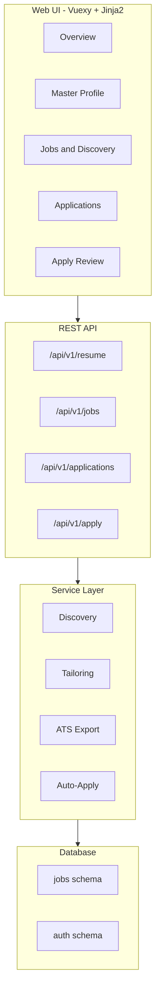
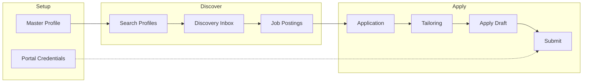

# Job Seeker Automation App — Overview

## What Is This?

A **semi-automated job application platform** that helps you manage your job search from resume to offer. Upload your resume into a structured master profile, discover or add job postings, tailor your resume per job with keyword analysis, review pre-filled application drafts, and track everything in a kanban pipeline.

Built on a Flask boilerplate with RBAC, Vuexy admin UI, and optional browser automation for discovery and submission.

## Core Philosophy

**Human-in-the-loop automation.** The app assists every step but never submits an application without your explicit review and approval.

- You review parsed resume data before saving
- You accept or skip discovered jobs
- You review tailored resume changes before approving
- You edit pre-filled form fields and cover letters
- You explicitly approve batches before auto-submission

## Key Features

### Master Profile
Upload PDF/DOCX, parse into structured JSON, human review before save. One active profile drives all tailoring and keyword analysis.

### Job Discovery
Automated search across Adzuna, Remotive, Greenhouse, Lever, RSS, Indeed, and LinkedIn. Jobs ranked by fit score in a review inbox.

### Keyword Analysis
Extract keywords from job descriptions. Compare against your profile. See matched and missing terms with coverage scores.

### Constrained Tailoring
Reorder, rephrase, and emphasize your experience per job. Never invent facts. Full diff audit trail for every change.

### ATS Export
Single-column DOCX with Calibri font, standard sections, and automated parse-test scoring.

### Application Pipeline
Kanban board tracking: Saved → Tailoring → Ready → Applied → Interview → Offer.

### Apply Pre-fill
Side-by-side JD keywords, tailored resume preview, editable form fields, and cover letter draft.

### Batch Auto-Apply
Group approved applications for automated portal submission (LinkedIn, Indeed, Greenhouse, Lever). Disabled by default; requires explicit approval.

### Analytics
Pipeline funnel, response rates, source effectiveness, and keyword coverage trends.

## Who Uses This?

| Audience | Start here |
|----------|------------|
| **Job seeker (end user)** | [User Guide](02-user-guide/README.md) → [Workflow](02-user-guide/WORKFLOW.md) |
| **Administrator** | [Admin Guide](04-operations/ADMIN_GUIDE.md) → [Automation Setup](04-operations/AUTOMATION_SETUP.md) |
| **Developer** | [Architecture](02-architecture/ARCHITECTURE.md) → [Services](02-architecture/JOB_SEEKER_SERVICES.md) |
| **New install** | [Getting Started](01-getting-started/GETTING_STARTED.md) → [First Run Checklist](01-getting-started/FIRST_RUN_CHECKLIST.md) |

## Architecture at a Glance



## End-to-End Workflow



1. **Upload resume** → review parsed JSON → save master profile
2. **Find jobs** → automated discovery or manual add
3. **Create application** → tailor resume → review changes
4. **Approve resume** → review apply draft → download DOCX
5. **Submit** → manually or via approved batch
6. **Track** → pipeline kanban and analytics

## Technology Stack

| Layer | Technology |
|-------|-----------|
| Backend | Flask 2.3, Python 3.12 |
| Database | PostgreSQL 16 (production), SQLite (dev) |
| Frontend | Vuexy (Bootstrap 5), Jinja2, Tailwind CSS |
| Resume | python-docx, pdfplumber |
| Browser automation | Playwright (optional) |
| LLM | OpenAI API (optional) |
| Background jobs | Celery + Redis (optional) |
| Auth | Flask-Login, RBAC, JWT |

## Quick Start

```bash
cp env.example .env
python -m venv venv && source venv/bin/activate
pip install -r requirements/requirements.txt -r requirements/requirements-jobs.txt
playwright install chromium
python scripts/init_database.py
python scripts/create_jobs_schema.py
python scripts/create_dev_user.py
python run.py
```

Open http://localhost:5000 — login: `admin@example.com` / `admin123`

Local dev does not require Redis, Celery, or Docker.

## Documentation Index

Full documentation: [docs/README.md](README.md)

| Section | Contents |
|---------|----------|
| [01-getting-started/](01-getting-started/) | Installation, first run |
| [02-user-guide/](02-user-guide/) | End-user guides |
| [02-architecture/](02-architecture/) | System design, services |
| [03-development/](03-development/) | API, scraping, modules |
| [04-operations/](04-operations/) | Admin, deployment, config |
| [05-reference/](05-reference/) | Data model, ATS rules |

## Version

Application version: **0.2.0** (Phase 2: Core Services)

## Related Docs

- [User Guide](02-user-guide/README.md)
- [Workflow](02-user-guide/WORKFLOW.md)
- [Getting Started](01-getting-started/GETTING_STARTED.md)
- [Admin Guide](04-operations/ADMIN_GUIDE.md)
