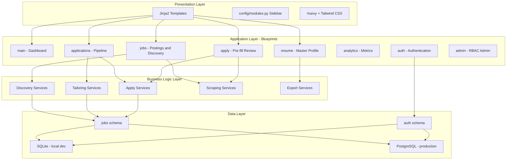

# Application Architecture

## Overview

This is a **semi-automated job application platform** built on a Flask boilerplate with RBAC, modular blueprints, and a service-oriented business logic layer. Users manage structured resumes, discover jobs, tailor applications, and track their pipeline — with optional browser automation for discovery and submission.

## Core Principles

1. **Human-in-the-loop** — Automation assists; users review before anything is submitted
2. **Modular Design** — Job seeker features organized into independent blueprints
3. **Service Layer** — Business logic in `app/services/`, routes stay thin
4. **RBAC Compliance** — Role-based access control from boilerplate foundation
5. **API-First** — RESTful API alongside web interface for all job seeker modules

## Job Seeker Module Architecture



## Architecture Layers

### 1. Presentation Layer

**Templates** (`app/templates/modules/`)
- `resume/` — Profile upload, review, edit, detail
- `jobs/` — Postings, discovery inbox, search profiles
- `applications/` — Pipeline kanban, detail, tailoring review, batches
- `apply/` — Pre-fill review, credentials
- `analytics/` — Metrics dashboard

**Navigation** — Sidebar driven by [`config/modules.py`](../../config/modules.py):
- Job Seeker section: Overview, Resume, Jobs, Applications, Analytics
- Management section: Admin (RBAC)
- Account section: User profile and settings

**Static Assets** (`app/static/`)
- Vuexy admin theme (Bootstrap 5)
- Custom CSS (`app-custom.css`) for tailoring diff UI
- Tailwind CSS build

### 2. Application Layer

**Job Seeker Blueprints** (`app/modules/`)

| Module | Prefix | Routes file | API file | Purpose |
|--------|--------|-------------|----------|---------|
| `main` | `/` | `main/routes.py` | — | Dashboard overview |
| `resume` | `/resume` | `resume/routes.py` | `resume/api.py` | Master profile management |
| `jobs` | `/jobs` | `jobs/routes.py` | `jobs/api.py` | Postings, discovery, inbox |
| `applications` | `/applications` | `applications/routes.py` | `applications/api.py` | Pipeline, tailoring, batches |
| `apply` | `/apply` | `apply/routes.py` | `apply/api.py` | Pre-fill review, credentials |
| `analytics` | `/analytics` | `analytics/routes.py` | — | Pipeline metrics |

**Boilerplate Blueprints** (inherited foundation):
- `auth` — Login, register, password reset, 2FA, OAuth
- `users` — Profile, settings, security
- `admin` — RBAC management, monitoring, developer sitemap

### 3. Business Logic Layer

**Services** (`app/services/`) — See [JOB_SEEKER_SERVICES.md](JOB_SEEKER_SERVICES.md) for full reference.

| Domain | Key services |
|--------|---------------|
| Profile | `resume_parser_service`, `profile_form_service`, `resume_export_service` |
| Discovery | `discovery_orchestrator`, `job_discovery_service`, `keyword_service`, `discovery/*` |
| Tailoring | `tailoring_service`, `tailoring_diff_service`, `llm_service` |
| Apply | `apply_draft_service`, `apply_batch_service`, `apply_submission_service`, `apply_adapters/*` |
| Scraping | `browser_manager`, `job_detail_enrichment`, `scraping/parsers/*`, `rate_limiter` |
| Tracking | `pipeline_service`, `activity_service`, `analytics_service` |
| Security | `credential_vault_service` |

**Background Tasks** (`app/tasks/job_tasks.py`):
- `batch_tailor_applications` — Background tailoring for multiple apps
- `submit_apply_batch` — Portal submission via Celery
- `run_scheduled_discovery` — Scheduled discovery runs (Celery beat)

### 4. Data Layer

**Database Schemas:**

| Schema | Tables | Purpose |
|--------|--------|---------|
| `auth` | users, roles, groups, permissions | Authentication and RBAC |
| `jobs` | master_profiles, job_postings, applications, etc. | Job seeker domain |

SQLite (local dev) uses flat tables; PostgreSQL uses schema prefixes.

See [JOB_SEEKER_DATA_MODEL.md](../05-reference/JOB_SEEKER_DATA_MODEL.md) for complete jobs schema reference.

## Application Factory Pattern

```python
# app/__init__.py
def create_app(config_name=None):
    app = Flask(__name__)
    init_config(app, config_name)
    init_extensions(app)      # DB, login, cache, celery, mail
    register_blueprints(app)  # All module blueprints
    return app
```

Entry points:
- `python run.py` — Development server
- `celery -A celery_app.celery worker` — Background worker
- `docker compose up` — Full stack (web, db, redis, celery)

## Request Flow

```
HTTP Request
  → Flask App (WSGI)
  → Middleware (CSRF, Rate Limiting)
  → Blueprint Router (module routes.py or api.py)
  → Service Layer (app/services/)
  → SQLAlchemy Models (app/models/)
  → Database (SQLite or PostgreSQL)
  → Response (Jinja2 template or JSON)
```

## Job Seeker Data Flow


## Deployment Modes

| Mode | Stack | Discovery | Batch submit |
|------|-------|-----------|--------------|
| Local dev | SQLite, `python run.py` | In-process (sync) | In-process (sync) |
| Docker | PostgreSQL, Redis, Celery | Celery worker | Celery worker |

Local dev does not require Redis, Celery, or Docker. See [GETTING_STARTED.md](../01-getting-started/GETTING_STARTED.md).

## Security Features

1. **Password Hashing** — Bcrypt with salt
2. **CSRF Protection** — Flask-WTF CSRF tokens
3. **Credential Encryption** — Fernet encryption for portal sessions (`CREDENTIAL_ENCRYPTION_KEY`)
4. **Account Lockout** — After 5 failed attempts (30 min)
5. **RBAC** — Permission checks on admin routes
6. **Rate Limiting** — Scrape and discovery rate limits
7. **Auto-apply gates** — Disabled by default; daily cap enforced

## Technology Stack

| Layer | Technology |
|-------|-----------|
| Backend | Flask 2.3, Python 3.12 |
| Database | PostgreSQL 16 (production), SQLite (dev) |
| ORM | SQLAlchemy 1.4 |
| Auth | Flask-Login, Flask-JWT-Extended |
| Frontend | Vuexy (Bootstrap 5), Jinja2, Tailwind CSS |
| Resume | python-docx, pdfplumber |
| Browser automation | Playwright |
| Background jobs | Celery 5.3 + Redis (optional) |
| LLM | OpenAI API (optional) |
| Testing | pytest |

## Extension System

**Core Extensions** (`app/extensions/`):
- `core.py` — Database, cache, login manager
- `config.py` — Environment variable loading
- `blueprints.py` — Blueprint registration
- `database_config.py` — Multi-database URI construction

## Related Docs

- [JOB_SEEKER_SERVICES.md](JOB_SEEKER_SERVICES.md) — Service layer reference
- [JOB_SEEKER_DATA_MODEL.md](../05-reference/JOB_SEEKER_DATA_MODEL.md) — Database tables
- [WORKFLOW.md](../02-user-guide/WORKFLOW.md) — End-user workflow
- [SCRAPING_AND_AUTOMATION.md](../03-development/SCRAPING_AND_AUTOMATION.md) — Browser automation
- [CONFIGURATION.md](../04-operations/CONFIGURATION.md) — Environment variables
- [RBAC_GUIDE.md](../03-development/rbac/RBAC_GUIDE.md) — Permission system (boilerplate)
