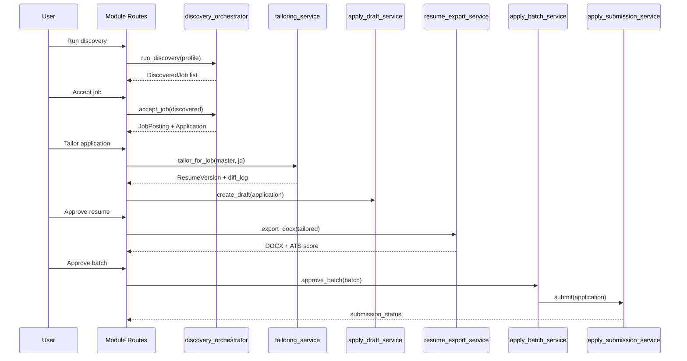

# Job Seeker Services

Service layer reference for the job seeker automation platform. Services live in [`app/services/`](../../app/services/) and are called by module routes and Celery tasks.

## Prerequisites

- [ARCHITECTURE.md](ARCHITECTURE.md) — System layers and request flow
- [JOB_SEEKER_DATA_MODEL.md](../05-reference/JOB_SEEKER_DATA_MODEL.md) — Data models

## Service Layer Overview

```mermaid
flowchart TD
    subgraph routes [Module Routes]
        ResumeRoutes[resume/routes.py]
        JobsRoutes[jobs/routes.py]
        AppRoutes[applications/routes.py]
        ApplyRoutes[apply/routes.py]
    end

    subgraph profile_layer [Profile and Export]
        Parser[resume_parser_service]
        Form[profile_form_service]
        Export[resume_export_service]
    end

    subgraph discovery_layer [Discovery]
        Orchestrator[discovery_orchestrator]
        JobDiscovery[job_discovery_service]
        Connectors[discovery connectors]
        Enrichment[job_detail_enrichment]
        Keyword[keyword_service]
    end

    subgraph tailoring_layer [Tailoring]
        Tailor[tailoring_service]
        Diff[tailoring_diff_service]
        LLM[llm_service]
    end

    subgraph apply_layer [Apply]
        Draft[apply_draft_service]
        Pipeline[pipeline_service]
        Activity[activity_service]
        Batch[apply_batch_service]
        Submit[apply_submission_service]
        Adapters[apply_adapters]
        Vault[credential_vault_service]
    end

    subgraph scraping_layer [Scraping]
        Browser[browser_manager]
        Parsers[scraping parsers]
        RateLimit[rate_limiter]
        SessionHealth[session_health]
    end

    ResumeRoutes --> Parser
    ResumeRoutes --> Export
    JobsRoutes --> Orchestrator
    JobsRoutes --> JobDiscovery
    JobsRoutes --> Keyword
    AppRoutes --> Tailor
    AppRoutes --> Pipeline
    AppRoutes --> Batch
    ApplyRoutes --> Draft
    ApplyRoutes --> Submit

    Orchestrator --> Connectors
    Orchestrator --> Keyword
    Orchestrator --> Enrichment
    Enrichment --> Browser
    Enrichment --> Parsers
    Tailor --> LLM
    Tailor --> Keyword
    Tailor --> Diff
    Tailor --> Export
    Draft --> LLM
    Submit --> Adapters
    Submit --> Vault
    Adapters --> Browser
    Connectors --> Browser
```

## Profile and Export Services

### resume_parser_service

**File:** `app/services/resume_parser_service.py`

Parses uploaded PDF or DOCX files into structured `profile_data` JSON.

| | |
|---|---|
| **Inputs** | File bytes, filename |
| **Outputs** | `profile_data` dict, parse confidence score |
| **Called by** | `resume/routes.py` upload flow |
| **Dependencies** | `pdfplumber` (PDF), `python-docx` (DOCX) |

### profile_form_service

**File:** `app/services/profile_form_service.py`

Converts between HTML form fields and `profile_data` JSON for manual profile creation and editing.

| | |
|---|---|
| **Inputs** | Form data or profile JSON |
| **Outputs** | Profile JSON or form field dict |
| **Called by** | `resume/routes.py` manual profile routes |

### resume_export_service

**File:** `app/services/resume_export_service.py`

Generates ATS-safe DOCX exports and runs parse-test validation.

| | |
|---|---|
| **Inputs** | `profile_data` dict, optional filename |
| **Outputs** | DOCX bytes, filename, parse-test score |
| **Called by** | Resume routes, tailoring flow, apply review |
| **Dependencies** | `python-docx` |

See [ATS_EXPORT_RULES.md](../05-reference/ATS_EXPORT_RULES.md) for format rules.

## Discovery Services

### discovery_orchestrator

**File:** `app/services/discovery_orchestrator.py`

Coordinates multi-source job discovery for a search profile.

| | |
|---|---|
| **Inputs** | `JobSearchProfile`, active `MasterProfile` |
| **Outputs** | `DiscoveredJob` records in inbox, `DiscoveryRun` audit logs |
| **Called by** | `jobs/routes.py` run discovery, Celery `job_tasks.py` |
| **Key methods** | `run_discovery()`, `accept_job()`, `skip_job()` |

**Flow:**
1. Load search profile criteria and enabled connectors
2. Run each connector (Adzuna, Remotive, Greenhouse, Lever, RSS, Indeed, LinkedIn)
3. Deduplicate against existing postings and inbox
4. Apply company blocklist
5. Score fit against active master profile
6. Stage new jobs in discovery inbox

### job_discovery_service

**File:** `app/services/job_discovery_service.py`

Handles individual job intake: URL fetch, manual paste parsing, fit scoring, and apply form field extraction.

| | |
|---|---|
| **Inputs** | Job URL or pasted text |
| **Outputs** | Parsed job fields, fit score, form fields |
| **Called by** | Job posting routes, discovery orchestrator on accept |

### keyword_service

**File:** `app/services/keyword_service.py`

Extracts keywords from job descriptions and computes coverage against master profile.

| | |
|---|---|
| **Inputs** | Job description text, `profile_data` |
| **Outputs** | `jd_keywords`, `matched_keywords`, `missing_keywords`, `coverage_score` |
| **Called by** | Discovery orchestrator, tailoring service, job posting detail |

### Discovery Connectors

**Directory:** `app/services/discovery/`

| Connector | File | Source type | Auth required |
|-----------|------|-------------|---------------|
| Adzuna | `adzuna.py` | API | `ADZUNA_APP_ID`, `ADZUNA_APP_KEY` |
| Remotive | `remotive.py` | API | None |
| Greenhouse | `greenhouse.py` | API | Board slugs in search profile |
| Lever | `lever.py` | API | Board slugs in search profile |
| Ashby | `ashby.py` | API | Board slugs in search profile (`ashby_boards`) |
| RSS | `rss_connector.py` | RSS feeds | Feed URLs in search profile |
| Indeed | `indeed.py` | Playwright scrape | Portal credentials, `INDEED_SCRAPE_ENABLED` |
| LinkedIn | `linkedin.py` | Playwright scrape | Portal credentials, `LINKEDIN_SCRAPE_ENABLED` |

All connectors implement the base interface in `discovery/base.py`:
- `search(criteria) → List[JobResult]`
- `source_name` property

Registered via `get_connectors()` in `discovery/__init__.py`.

### job_detail_enrichment

**File:** `app/services/scraping/job_detail_enrichment.py`

Fetches full job description from Indeed/LinkedIn when list results have thin descriptions.

| | |
|---|---|
| **Inputs** | Job URL, portal type |
| **Outputs** | Enriched description, requirements, metadata |
| **Called by** | Discovery orchestrator on accept, posting refresh |
| **Dependencies** | `browser_manager`, portal parsers |

## Tailoring Services

### tailoring_service

**File:** `app/services/tailoring_service.py`

Constrained resume tailoring — reorders, rephrases, and emphasizes without inventing facts.

| | |
|---|---|
| **Inputs** | Master `profile_data`, job title, description, company |
| **Outputs** | Tailored `profile_data`, `diff_log` |
| **Called by** | `applications/routes.py` tailor action, Celery batch tailor |
| **Dependencies** | `keyword_service`, `llm_service` |
| **Env** | `OPENAI_API_KEY` (optional; heuristic fallback without) |

**Constraints:**
- Maximum 5 bullet changes per tailoring run
- Sets headline to job title
- Selects best summary variant for JD keywords
- Rephrases bullets to include missing keywords (via LLM or heuristic)

### tailoring_diff_service

**File:** `app/services/tailoring_diff_service.py`

Generates human-readable diff summaries and comparison views between master and tailored profiles.

| | |
|---|---|
| **Inputs** | Master data, tailored data, diff_log |
| **Outputs** | Diff summary, section comparisons, exportable report |
| **Called by** | Tailoring review template |

### llm_service

**File:** `app/services/llm_service.py`

OpenAI-compatible LLM wrapper with heuristic fallback when no API key is configured.

| | |
|---|---|
| **Inputs** | Prompts for bullet rephrasing, cover letter generation |
| **Outputs** | Rephrased text, cover letter draft |
| **Called by** | `tailoring_service`, `apply_draft_service` |
| **Env** | `GEMINI_API_KEY` / `GOOGLE_API_KEY` + `GEMINI_MODEL`, or `OPENAI_API_KEY` + `OPENAI_MODEL`; `LLM_PROVIDER=auto\|gemini\|openai` |

Without API keys, uses rule-based fallbacks (simple keyword insertion, template cover letters).

## Apply Services

### apply_draft_service

**File:** `app/services/apply_draft_service.py`

Creates and refreshes pre-filled application form fields and cover letter drafts.

| | |
|---|---|
| **Inputs** | Application, tailored resume, job posting |
| **Outputs** | `ApplyDraft` with `form_fields` and `cover_letter` |
| **Called by** | Tailoring approval, apply review routes |

### pipeline_service

**File:** `app/services/pipeline_service.py`

Aggregates applications by pipeline stage for kanban board display.

| | |
|---|---|
| **Inputs** | User ID |
| **Outputs** | Stage-grouped application lists |
| **Called by** | Pipeline route, pipeline API |

### activity_service

**File:** `app/services/activity_service.py`

Records timeline events on applications (tailor, approve, submit, notes).

| | |
|---|---|
| **Inputs** | Application ID, activity type, description |
| **Outputs** | `ApplicationActivity` record |
| **Called by** | Application routes, submission service |

### apply_batch_service

**File:** `app/services/apply_batch_service.py`

Creates apply batches, validates readiness, enforces daily cap, and approves for submission.

| | |
|---|---|
| **Inputs** | Application IDs, user ID |
| **Outputs** | `ApplyBatch`, readiness report |
| **Called by** | Batch routes, Celery submit task |
| **Env** | `DAILY_APPLY_CAP` (default 25) |

**Readiness checks per application:**
- Tailored resume exists with status `approved`
- Apply draft is complete
- Application stage is `ready_to_apply`

### apply_submission_service

**File:** `app/services/apply_submission_service.py`

Orchestrates per-application portal submission via adapters.

| | |
|---|---|
| **Inputs** | Application, apply draft, portal credentials |
| **Outputs** | Submission status, proof screenshot, error message |
| **Called by** | Celery `submit_apply_batch` task |
| **Dependencies** | `apply_adapters`, `credential_vault_service`, `browser_manager` |

### Apply Adapters

**Directory:** `app/services/apply_adapters/`

| Adapter | File | Portal | Enabled by |
|---------|------|--------|------------|
| LinkedIn | `linkedin.py` | LinkedIn Easy Apply | `LINKEDIN_AUTO_APPLY_ENABLED` |
| Indeed | `indeed.py` | Indeed Apply | Pre-fill + proof; `needs_manual` (D6) |
| Greenhouse | `greenhouse.py` | Greenhouse ATS | `APPLY_AUTOMATION_ENABLED` |
| Lever | `lever.py` | Lever ATS | `APPLY_AUTOMATION_ENABLED` |
| Ashby | `ashby.py` | Ashby ATS | Always `needs_manual` (pre-fill metadata) |
| Generic | `generic.py` | Fallback | Always available |

Registered via `apply_adapters/registry.py`. All implement `base.py` interface:
- `can_handle(url) → bool`
- `submit(application, draft, credentials) → SubmissionResult`

### credential_vault_service

**File:** `app/services/credential_vault_service.py`

Encrypts and decrypts portal session JSON using Fernet symmetric encryption.

| | |
|---|---|
| **Inputs** | Portal type, session JSON |
| **Outputs** | Encrypted `PortalCredential` record |
| **Called by** | Credentials route, submission service, scraping |
| **Env** | `CREDENTIAL_ENCRYPTION_KEY` (required for persistence across restarts) |

## Scraping Services

### browser_manager

**File:** `app/services/scraping/browser_manager.py`

Manages Playwright browser instances with session state, rate limiting, and headed/headless modes.

| | |
|---|---|
| **Inputs** | Portal credentials, target URL |
| **Outputs** | Page content, screenshots |
| **Called by** | Discovery connectors, enrichment, apply adapters |
| **Env** | `PLAYWRIGHT_HEADLESS`, `PLAYWRIGHT_CHANNEL`, `INDEED_PLAYWRIGHT_HEADLESS` |

### Scraping Parsers

**Directory:** `app/services/scraping/parsers/`

| Parser | File | Portal |
|--------|------|--------|
| Indeed | `indeed_parser.py` | Indeed job detail pages |
| LinkedIn | `linkedin_parser.py` | LinkedIn job detail pages |

### rate_limiter

**File:** `app/services/scraping/rate_limiter.py`

Enforces per-hour scrape rate limits with optional Redis backing.

| | |
|---|---|
| **Env** | `SCRAPE_RATE_LIMIT_PER_HOUR`, `SCRAPE_USE_REDIS`, `SCRAPE_DELAY_MIN_MS`, `SCRAPE_DELAY_MAX_MS` |

### session_health

**File:** `app/services/scraping/session_health.py`

Tests stored portal credentials by attempting a lightweight page load.

| | |
|---|---|
| **Called by** | Credentials route test action |

## Analytics Service

### analytics_service

**File:** `app/services/analytics_service.py`

Aggregates pipeline metrics: funnel conversion, response rates, source effectiveness, keyword coverage trends.

| | |
|---|---|
| **Inputs** | User ID, date range |
| **Outputs** | Summary metrics dict |
| **Called by** | Analytics routes and API |

## Background Tasks

**File:** `app/tasks/job_tasks.py`

| Task | Trigger | Services used |
|------|---------|---------------|
| `batch_tailor_applications` | User clicks batch tailor | `tailoring_service`, `apply_draft_service` |
| `submit_apply_batch` | User approves batch | `apply_submission_service`, adapters |
| `run_all_active_discoveries` | Celery beat schedule (every 6h) | `discovery_orchestrator` |
| `run_discovery_for_profile` | Manual / programmatic | `discovery_orchestrator` |

**Local dev:** Discovery and tailoring run synchronously in the Flask process when Redis/Celery are not configured.

## Service Call Flow: End-to-End

## Related Docs

- [ARCHITECTURE.md](ARCHITECTURE.md) — System architecture
- [SCRAPING_AND_AUTOMATION.md](../03-development/SCRAPING_AND_AUTOMATION.md) — Playwright and connector development
- [JOB_SEEKER_API.md](../03-development/JOB_SEEKER_API.md) — API endpoints
- [AUTOMATION_SETUP.md](../04-operations/AUTOMATION_SETUP.md) — Environment configuration
- [JOB_SEEKER_DATA_MODEL.md](../05-reference/JOB_SEEKER_DATA_MODEL.md) — Database tables
