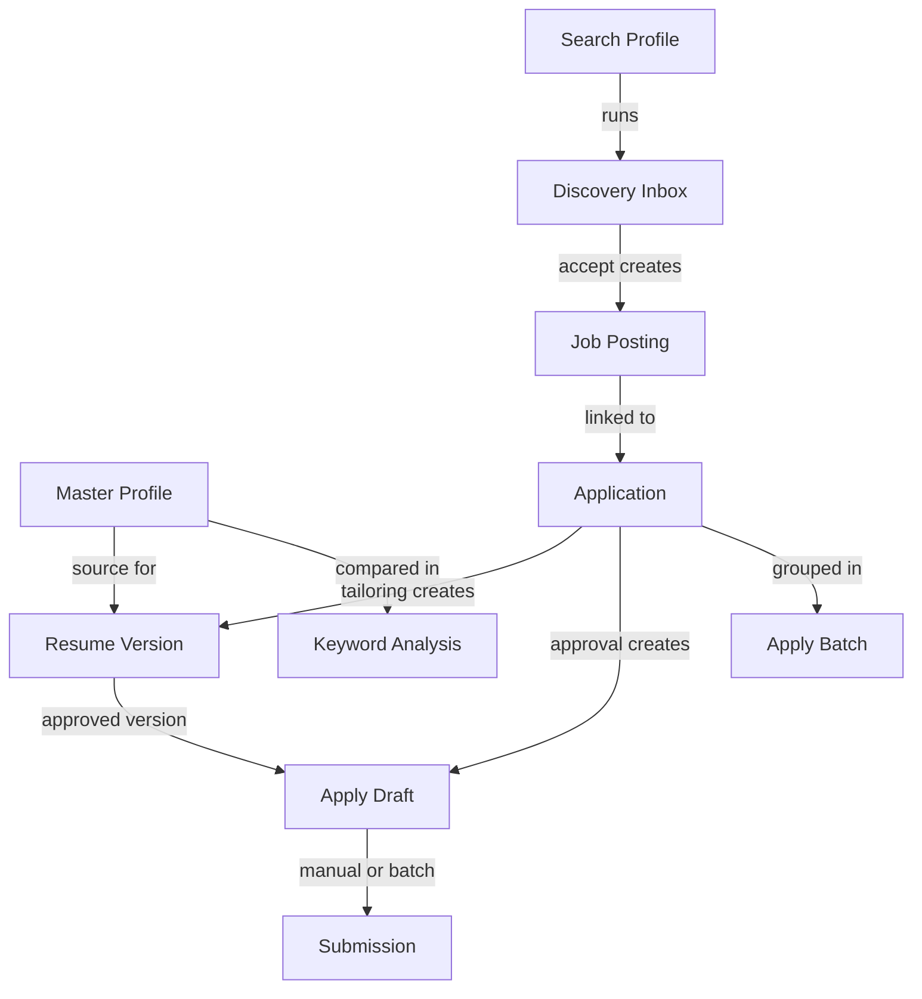

# Concepts

Key terms and concepts used throughout the Job Seeker Automation App.

## Prerequisites

None — start here if you're new to the application.

## Core Concepts

### Master Profile

Your **master profile** is the canonical, structured version of your resume stored as JSON in the database. It is the single source of truth for all tailoring and exports.

- Created by uploading a PDF/DOCX or entering data manually
- Parsed into sections: contact, summary, experience, education, skills
- One profile is marked **active** at a time
- All tailoring starts from the active master profile
- Never modified by tailoring — tailored versions are separate records

**Where:** Resume → Master Profile (`/resume/profiles`)

### Job Posting

A **job posting** is a saved job you want to track or apply to. It stores the job title, company, description, location, salary, and source.

Postings come from:
- **Manual paste** — You type or paste job details
- **URL fetch** — App extracts details from a job listing URL
- **Discovery** — Promoted from the discovery inbox after automated search
- **RSS** — From configured RSS feeds

**Where:** Jobs → Job Postings (`/jobs/postings`)

### Application

An **application** links you to a specific job posting and tracks your progress through the hiring pipeline. Each application has a **stage** that moves through the workflow.

One application per job posting per user (typically).

**Where:** Applications → All Applications (`/applications/list`)

### Application Stages

Applications move through these stages:

| Stage | Meaning |
|-------|---------|
| `saved` | Application created; not yet tailored |
| `tailoring` | Resume tailoring in progress or awaiting review |
| `ready_to_apply` | Resume approved; apply draft ready for review |
| `applied` | Submitted to the employer |
| `phone_screen` | Phone screen scheduled or completed |
| `interview` | Interview stage |
| `offer` | Offer received |
| `rejected` | Rejected by employer |
| `withdrawn` | You withdrew the application |

Stages update automatically during tailoring and approval, or manually via the pipeline kanban board.

### Resume Version

A **resume version** is a tailored copy of your master profile created for a specific job. It records every change in a diff log for audit.

| Status | Meaning |
|--------|---------|
| `draft` | Initial version |
| `pending_approval` | Tailored; waiting for your review |
| `approved` | You approved it for submission |
| `archived` | Superseded or discarded |

Tailoring never invents facts — it reorders, rephrases, and emphasizes existing experience.

### Keyword Analysis

When you tailor or view a job posting, the app extracts keywords from the job description and compares them to your master profile.

Results show:
- **Matched keywords** — Already in your profile
- **Missing keywords** — In the JD but not in your profile
- **Coverage score** — Percentage of JD keywords covered

Higher coverage generally means better ATS match scores.

### Apply Draft

An **apply draft** is a pre-filled application form with field values and a cover letter draft. It is created after tailoring and refreshed on approval.

You review and edit the draft before submitting. The app never auto-submits without your explicit action.

**Where:** Reached from application detail → Review & Apply (`/apply/<id>`)

### Discovery Inbox

The **discovery inbox** holds jobs found by automated search that you haven't yet accepted or skipped. Jobs are ranked by **fit score** — how well they match your active master profile.

- **Accept** — Creates a job posting and application (stage: `saved`)
- **Skip** — Dismisses the job from inbox

**Where:** Jobs → Discovery Inbox (`/jobs/inbox`)

### Search Profile

A **search profile** defines criteria for automated job discovery: target titles, locations, sources, and filters. You can have multiple search profiles for different job searches.

**Where:** Jobs → Search Profiles (`/jobs/search-profiles`)

### Apply Batch

An **apply batch** groups multiple applications for automated portal submission. You review readiness for each application, then explicitly approve the batch.

Auto-apply is disabled by default and requires portal credentials.

**Where:** Applications → Apply Batches (`/applications/batches`)

### Portal Credentials

**Portal credentials** are encrypted browser session data for LinkedIn, Indeed, and other job portals. They let the app scrape job listings and optionally auto-apply on your behalf.

You export sessions locally via a script, then paste the JSON in the credentials page. Sessions are encrypted at rest.

**Where:** `/apply/credentials` (not in sidebar; linked from apply flow)

## How Concepts Relate

## Data You Control vs. Automation

| You always control | Automation assists with |
|--------------------|------------------------|
| Saving master profile | Parsing uploaded resume |
| Accepting/skipping discovered jobs | Running discovery connectors |
| Approving tailored resume | Generating tailored version and diff |
| Editing apply draft fields | Pre-filling form fields and cover letter |
| Marking as applied or approving batch | Portal submission (after approval) |
| Moving pipeline cards | Stage updates during tailor/approve |

## Related Docs

- [WORKFLOW.md](WORKFLOW.md) — Step-by-step process using these concepts
- [MASTER_PROFILE.md](MASTER_PROFILE.md) — Master profile in detail
- [JOB_DISCOVERY.md](JOB_DISCOVERY.md) — Discovery and inbox
- [JOB_SEEKER_DATA_MODEL.md](../05-reference/JOB_SEEKER_DATA_MODEL.md) — Technical data model
