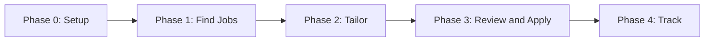
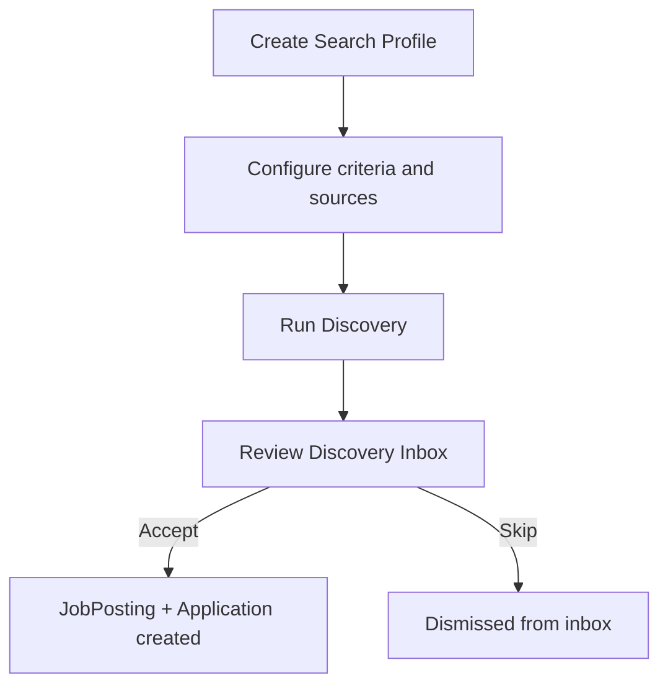
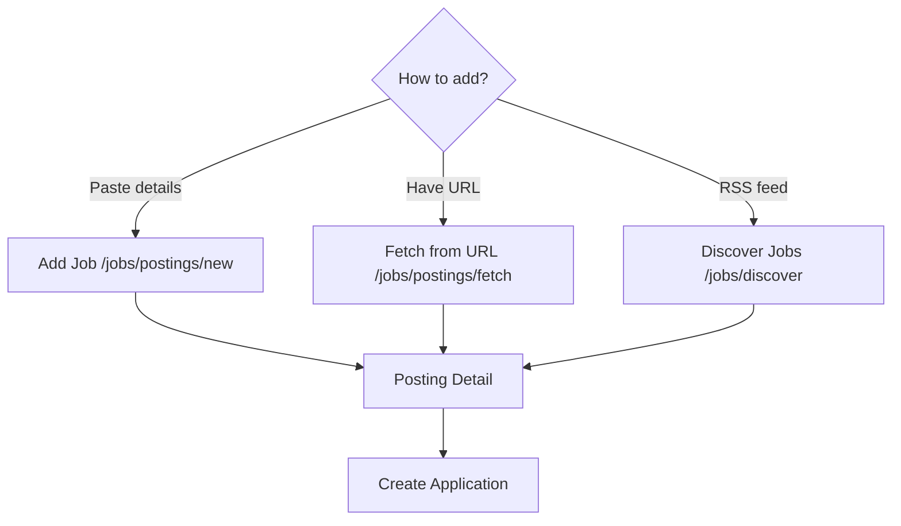
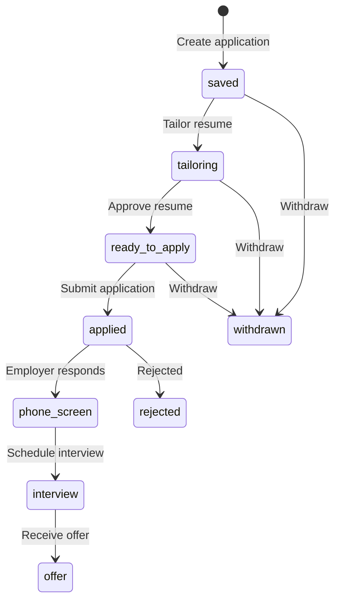

# Workflow

Complete end-to-end workflow from first login through application submission and pipeline tracking.

## Prerequisites

- Account created and logged in
- Familiarity with [CONCEPTS.md](CONCEPTS.md) recommended

## Overview

The job search workflow has five phases:

| Phase | Goal | Key routes |
|-------|------|------------|
| 0 — Setup | Create master profile | `/resume/upload` |
| 1 — Find Jobs | Discover or add job postings | `/jobs/search-profiles`, `/jobs/inbox`, `/jobs/postings` |
| 2 — Tailor | Customize resume per job | `/applications/<id>/tailor` |
| 3 — Review & Apply | Approve and submit | `/applications/<id>/tailoring`, `/apply/<id>` |
| 4 — Track | Monitor pipeline | `/applications/pipeline`, `/analytics/` |

---

## Phase 0: Setup

### Step 1: Log in

Navigate to `/auth/login` and sign in with your credentials.

### Step 2: Upload your resume

1. Go to **Resume → Upload Resume** (`/resume/upload`)
2. Select a PDF or DOCX file
3. Click **Upload and Parse**

The app extracts contact info, experience, education, and skills into structured JSON.

### Step 3: Review and save

1. Review the parsed data on the review page (`resume/review.html`)
2. Correct any parsing errors in the JSON editor
3. Click **Save Profile**

Your profile is saved and set as the **active** master profile.

### Step 4 (optional): Set up portal credentials

If you plan to use LinkedIn/Indeed discovery or auto-apply, set up credentials at `/apply/credentials`. See [BATCH_AUTO_APPLY.md](BATCH_AUTO_APPLY.md).

---

## Phase 1: Find Jobs

Two paths: **automated discovery** or **manual intake**.

### Path A: Automated Discovery

1. **Create a search profile** at `/jobs/search-profiles/new`
   - Set target titles (e.g. "Senior Software Engineer")
   - Set locations and remote preference
   - Enable sources: Adzuna, Remotive, Greenhouse, Lever, RSS, Indeed, LinkedIn
   - Set minimum fit score (default 50)

2. **Run discovery** from the search profiles list (`POST /jobs/search-profiles/<id>/run`)
   - Locally: runs immediately in the Flask process
   - Docker: queued to Celery worker

3. **Review the inbox** at `/jobs/inbox`
   - Jobs ranked by fit score (highest first)
   - Each card shows title, company, location, source, fit score

4. **Accept or skip**
   - **Accept** → Creates `JobPosting` + `Application` (stage: `saved`)
   - **Skip** → Removes from inbox

See [JOB_DISCOVERY.md](JOB_DISCOVERY.md) for detailed configuration.

### Path B: Manual Job Intake

1. **Add a job** using one of:
   - **Manual paste** — `/jobs/postings/new`
   - **URL fetch** — `/jobs/postings/fetch` (extracts title, company, description)
   - **RSS** — `/jobs/discover` (subscribe to feeds)

2. **View posting detail** at `/jobs/postings/<id>`
   - Full job description
   - Keyword coverage vs your active profile
   - Fit score

3. **Create application** — Click **Create Application** or go to `/applications/new?job_id=<id>`

---

## Phase 2: Tailor

### Step 1: Open application detail

Navigate to `/applications/<id>`. You'll see:
- Job title and company
- Current stage (`saved`)
- Activity timeline
- Action buttons: **Tailor Resume**, **Add Notes**

### Step 2: Run tailoring

Click **Tailor Resume** (`POST /applications/<id>/tailor`). The app:

1. Creates a `ResumeVersion` (status: `pending_approval`)
2. Sets application stage to `tailoring`
3. Runs keyword analysis (JD vs master profile)
4. Tailors resume: reorders bullets, rephrases for keywords, selects summary
5. Records all changes in diff log
6. Runs ATS parse-test on export
7. Seeds an apply draft with form fields

### Step 3: Review tailoring

Open the tailoring review page at `/applications/<id>/tailoring`. Tabs:

| Tab | Content |
|-----|---------|
| Overview | Summary of changes, keyword impact |
| Resume | Tailored resume preview |
| Cover Letter | Generated cover letter draft |
| Changes | Diff log — what changed and why |
| Compare | Side-by-side master vs tailored |
| Keywords | Matched and missing keywords |

See [TAILORING_AND_APPLY.md](TAILORING_AND_APPLY.md) for details.

---

## Phase 3: Review and Apply

### Step 1: Approve tailored resume

On the application detail or tailoring page, click **Approve Resume** (`POST /applications/<id>/approve`):

1. Resume version status → `approved`
2. Application stage → `ready_to_apply`
3. Apply draft regenerated with cover letter
4. Redirected to apply review page

### Step 2: Review apply draft

At `/apply/<id>`, review:

- **Job keywords** — Matched and missing terms
- **Form fields** — Pre-filled application fields (editable)
- **Cover letter** — Editable draft (regenerate with LLM if configured)
- **Resume preview** — Text preview of DOCX export
- **Downloads** — DOCX resume and cover letter

Edit any fields, then save (`POST /apply/<id>/save-draft`).

### Step 3: Submit

Choose one of two submission paths:

#### Manual submission (recommended for most users)

1. Download tailored resume DOCX
2. Download cover letter (TXT or DOCX)
3. Apply on the employer's website
4. Return and click **Mark as Applied** (`POST /apply/<id>/mark-applied`)
5. Application stage → `applied`

#### Batch auto-apply (requires setup)

1. Go to **Applications → Apply Queue** (`/applications/queue`)
2. Select ready applications
3. Create and approve a batch
4. See [BATCH_AUTO_APPLY.md](BATCH_AUTO_APPLY.md)

---

## Phase 4: Track

### Pipeline kanban

Open **Applications → Pipeline** (`/applications/pipeline`):

- Cards organized by stage columns
- Drag cards between stages to update status
- Stages: Saved, Tailoring, Ready, Applied, Phone Screen, Interview, Offer

Stage updates via `PATCH /api/v1/applications/<id>/stage`.

### Analytics

Open **Analytics** (`/analytics/`) for:
- Application funnel (how many at each stage)
- Response rate
- Source effectiveness (which discovery sources produce results)
- Keyword coverage trends

See [ANALYTICS.md](ANALYTICS.md).

---

## Application Stage Lifecycle

Stages `rejected` and `withdrawn` are terminal. All other stages can be set manually via the pipeline board.

---

## Quick Reference: Where to Start

| Goal | Start here |
|------|------------|
| First-time setup | `/resume/upload` |
| Find jobs automatically | `/jobs/search-profiles` → `/jobs/inbox` |
| Add a job manually | `/jobs/postings/new` or `/jobs/postings/fetch` |
| Work one job end-to-end | `/jobs/postings/<id>` → `/applications/new` |
| Review tailoring | `/applications/<id>/tailoring` |
| Review apply draft | `/apply/<id>` |
| Bulk apply | `/applications/queue` → `/applications/batches` |
| Track progress | `/applications/pipeline` |
| View metrics | `/analytics/` |

## Tips

1. **Always review parsed resume data** — Parser accuracy varies by format
2. **Check keyword coverage before tailoring** — View posting detail first
3. **Review the diff log** — Verify tailoring didn't misrepresent your experience
4. **Save apply draft edits** — Before downloading or submitting
5. **Update pipeline regularly** — Drag cards as status changes for accurate analytics

## Related Docs

- [CONCEPTS.md](CONCEPTS.md) — Key terms
- [MASTER_PROFILE.md](MASTER_PROFILE.md) — Resume setup
- [JOB_DISCOVERY.md](JOB_DISCOVERY.md) — Finding jobs
- [TAILORING_AND_APPLY.md](TAILORING_AND_APPLY.md) — Tailoring and apply review
- [BATCH_AUTO_APPLY.md](BATCH_AUTO_APPLY.md) — Batch submission
- [APPLICATIONS.md](APPLICATIONS.md) — Pipeline management
