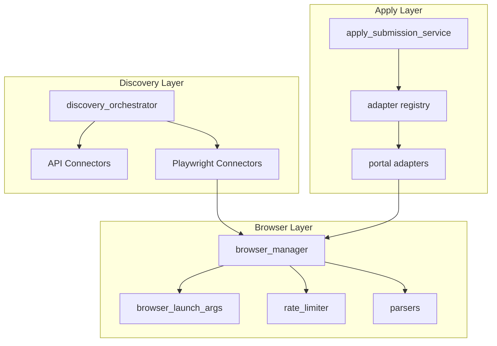

# Scraping and Automation

Developer guide for Playwright browser automation, discovery connectors, and apply adapters.

## Prerequisites

- Playwright installed: `playwright install chromium`
- [JOB_SEEKER_SERVICES.md](../02-architecture/JOB_SEEKER_SERVICES.md) — Service layer overview
- [AUTOMATION_SETUP.md](../04-operations/AUTOMATION_SETUP.md) — Environment configuration

## Architecture



## Playwright Setup

### Installation

```bash
pip install -r requirements/requirements-jobs.txt
playwright install chromium
```

### Environment variables

```env
PLAYWRIGHT_HEADLESS=true
PLAYWRIGHT_CHANNEL=chrome
INDEED_PLAYWRIGHT_HEADLESS=false
SCRAPE_RATE_LIMIT_PER_HOUR=20
SCRAPE_DELAY_MIN_MS=2000
SCRAPE_DELAY_MAX_MS=6000
SCRAPE_USE_REDIS=false
```

### Browser manager

**File:** `app/services/scraping/browser_manager.py`

Central browser lifecycle management:

```python
from app.services.scraping.browser_manager import browser_manager

# Get a page with optional session state
page = browser_manager.get_page(
    portal_credentials=decrypted_creds,
    headless=True,
)
page.goto(url)
content = page.content()
browser_manager.close()
```

Features:
- Session state injection from portal credentials
- Headed/headless mode per portal
- Human-like delays between actions
- Screenshot capture for proofs
- Rate limiting integration

### Launch arguments

**File:** `app/services/scraping/browser_launch_args.py`

Configures Chromium launch args for anti-detection:
- Disables automation flags
- Sets user agent from stored credentials
- Configures viewport and locale

### Rate limiter

**File:** `app/services/scraping/rate_limiter.py`

```python
from app.services.scraping.rate_limiter import scrape_rate_limiter

scrape_rate_limiter.check(user_id, 'linkedin')  # Raises if over limit
scrape_rate_limiter.record(user_id, 'linkedin')
```

Backing store: in-memory (default) or Redis (`SCRAPE_USE_REDIS=true`).

## Discovery Connectors

### Base interface

**File:** `app/services/discovery/base.py`

```python
@dataclass
class DiscoveredJobDTO:
    title: str
    company: str
    description: str = ''
    url: str = ''
    source: str = 'api'
    source_id: str = ''
    location: str = ''
    seniority: str = ''
    salary_min: Optional[float] = None
    salary_max: Optional[float] = None
    raw_data: Dict[str, Any] = field(default_factory=dict)

class DiscoveryConnector(Protocol):
    source_name: str

    def search(
        self,
        profile_data: Dict[str, Any],
        limit: int = 50,
        user_id=None,
    ) -> List[DiscoveredJobDTO]:
        ...
```

### Existing connectors

| Connector | File | Method | Auth |
|-----------|------|--------|------|
| Adzuna | `discovery/adzuna.py` | REST API | `ADZUNA_APP_ID/KEY` |
| Remotive | `discovery/remotive.py` | REST API | None |
| Greenhouse | `discovery/greenhouse.py` | REST API | Board slugs |
| Lever | `discovery/lever.py` | REST API | Board slugs |
| RSS | `discovery/rss_connector.py` | feedparser | Feed URLs |
| Indeed | `discovery/indeed.py` | Playwright | Portal credentials |
| LinkedIn | `discovery/linkedin.py` | Playwright | Portal credentials |

### Registration

**File:** `app/services/discovery/__init__.py`

```python
def get_connectors(enabled_sources: List[str]) -> List[DiscoveryConnector]:
    # Returns connector instances for enabled sources
```

Connectors are instantiated based on search profile `sources` list and environment flags.

### Adding a new connector

1. Create `app/services/discovery/my_connector.py`:

```python
from app.services.discovery.base import DiscoveredJobDTO, DiscoverySearchError

class MyConnector:
    source_name = 'my_source'

    def search(self, profile_data, limit=50, user_id=None):
        titles = profile_data.get('titles', [])
        results = []
        # Fetch jobs from your source
        for job in fetch_jobs(titles, limit):
            results.append(DiscoveredJobDTO(
                title=job['title'],
                company=job['company'],
                description=job.get('description', ''),
                url=job['url'],
                source=self.source_name,
                source_id=job['id'],
                location=job.get('location', ''),
            ))
        return results
```

2. Register in `app/services/discovery/__init__.py`:

```python
from app.services.discovery.my_connector import MyConnector

CONNECTOR_MAP = {
    ...
    'my_source': MyConnector,
}
```

3. Add `'my_source'` as an option in search profile UI (`jobs/search_profile_form.html`).

4. Write tests in `tests/test_my_connector.py`.

### Orchestrator integration

The orchestrator (`discovery_orchestrator.py`) calls connectors via:

```python
connectors = get_connectors(profile.sources)
for connector in connectors:
    run = DiscoveryRun(source=connector.source_name, status='running')
    try:
        jobs = connector.search(criteria, limit=50, user_id=user_id)
        # deduplicate, blocklist, fit score, stage in inbox
    except DiscoverySearchError as e:
        run.status = 'failed'
        run.error_message = str(e)
```

## HTML Parsers

**Directory:** `app/services/scraping/parsers/`

Parse job detail pages after browser fetch:

| Parser | File | Portal |
|--------|------|--------|
| Indeed | `indeed_parser.py` | indeed.com job pages |
| LinkedIn | `linkedin_parser.py` | linkedin.com job pages |

### Parser interface

```python
def parse_job_detail(html: str, url: str) -> Dict[str, Any]:
    return {
        'title': '',
        'company': '',
        'description': '',
        'requirements': '',
        'location': '',
        'salary_min': None,
        'salary_max': None,
    }
```

### Job detail enrichment

**File:** `app/services/scraping/job_detail_enrichment.py`

Called when a discovered job or posting has a thin description:

```python
from app.services.scraping.job_detail_enrichment import enrich_job_detail

enriched = enrich_job_detail(url, portal='indeed', user_id=user_id)
# Returns full description, requirements, etc.
```

## Apply Adapters

### Base interface

**File:** `app/services/apply_adapters/base.py`

```python
@dataclass
class ApplyContext:
    application_id: str
    job_url: str
    job_title: str
    company: str
    resume_path: str
    form_fields: Dict[str, Any]
    user_id: str
    portal_credentials: Optional[Dict[str, Any]] = None

@dataclass
class ApplyResult:
    success: bool
    status: str  # submitted, needs_manual, failed
    message: str = ''
    proof_path: str = ''
    metadata: Dict[str, Any] = field(default_factory=dict)

class ApplyAdapter(Protocol):
    portal_name: str

    def can_handle(self, url: str) -> bool:
        ...

    def submit(self, context: ApplyContext) -> ApplyResult:
        ...
```

### Existing adapters

| Adapter | File | URL pattern | Method |
|---------|------|-------------|--------|
| LinkedIn | `apply_adapters/linkedin.py` | `linkedin.com/jobs` | Playwright Easy Apply |
| Indeed | `apply_adapters/indeed.py` | `indeed.com` | Playwright Apply |
| Greenhouse | `apply_adapters/greenhouse.py` | `boards.greenhouse.io` | API form submit |
| Lever | `apply_adapters/lever.py` | `jobs.lever.co` | API form submit |
| Generic | `apply_adapters/generic.py` | Fallback | Marks `needs_manual` |

### Registry

**File:** `app/services/apply_adapters/registry.py`

```python
from app.services.apply_adapters.registry import get_adapter_for_url

adapter = get_adapter_for_url(job_url)
if adapter:
    result = adapter.submit(context)
```

### Adding a new adapter

1. Create `app/services/apply_adapters/my_portal.py`:

```python
class MyPortalAdapter:
    portal_name = 'my_portal'

    def can_handle(self, url: str) -> bool:
        return 'myportal.com' in url

    def submit(self, context: ApplyContext) -> ApplyResult:
        try:
            # Use browser_manager or API to submit
            # Fill form fields from context.form_fields
            # Upload resume from context.resume_path
            # Capture screenshot proof
            return ApplyResult(
                success=True,
                status='submitted',
                proof_path='/path/to/screenshot.png',
            )
        except Exception as e:
            return ApplyResult(
                success=False,
                status='failed',
                message=str(e),
            )
```

2. Register in `app/services/apply_adapters/registry.py`.

3. Add portal type to `PortalType` enum in `app/models/jobs.py` if needed.

4. Write tests in `tests/test_my_portal_adapter.py`.

## Session Export

**File:** `scripts/export_playwright_storage.py`

Export portal sessions for credential storage:

```bash
python scripts/export_playwright_storage.py linkedin
python scripts/export_playwright_storage.py indeed
```

Output JSON structure:
```json
{
  "storage_state": { "cookies": [...], "origins": [...] },
  "user_agent": "Mozilla/5.0 ..."
}
```

### Session health check

**File:** `app/services/scraping/session_health.py`

```python
from app.services.scraping.session_health import check_session_health

result = check_session_health(portal='linkedin', credentials=decrypted)
# result = {'healthy': True, 'message': 'Session valid'}
```

## Celery Tasks

**File:** `app/tasks/job_tasks.py`

| Task | Description |
|------|-------------|
| `batch_tailor_applications` | Tailor multiple applications in background |
| `submit_apply_batch` | Submit approved batch via adapters |
| `run_all_active_discoveries` | Run discovery for all active search profiles (beat every 6h) |
| `run_discovery_for_profile` | Run discovery for a single search profile |

### Running tasks locally

Without Celery, routes call services directly (synchronous). To test Celery locally:

```bash
# Terminal 1
redis-server

# Terminal 2
celery -A celery_app.celery worker --loglevel=info -Q scraping,default

# Terminal 3
python run.py
```

## Testing

### Run scraping tests

```bash
pytest tests/test_indeed_scraper.py -v
pytest tests/test_browser_manager.py -v
pytest tests/test_job_detail_enrichment.py -v
```

### HTML fixtures

Test fixtures in `tests/fixtures/`:
- `indeed_job_detail.html` — Static Indeed page HTML
- `indeed_job_detail_live.html` — Captured live page

### Writing scraper tests

```python
def test_indeed_parser_extracts_title():
    with open('tests/fixtures/indeed_job_detail.html') as f:
        html = f.read()
    result = indeed_parser.parse_job_detail(html, 'https://indeed.com/job/123')
    assert result['title']
    assert result['company']
    assert len(result['description']) > 100
```

### Mocking browser in tests

```python
@pytest.fixture
def mock_browser(monkeypatch):
    class MockPage:
        def goto(self, url): pass
        def content(self): return '<html>...</html>'
        def screenshot(self, path): pass
    monkeypatch.setattr('app.services.scraping.browser_manager.browser_manager.get_page', lambda **kw: MockPage())
```

## Scrape Proofs

Screenshots saved during scraping and submission:

**Directory:** `instance/scrape_proofs/`

Naming: `{portal}_{timestamp}_{application_id}.png`

Viewable from application detail page via `submission_proof` field.

## Related Docs

- [AUTOMATION_SETUP.md](../04-operations/AUTOMATION_SETUP.md) — Admin setup guide
- [JOB_SEEKER_SERVICES.md](../02-architecture/JOB_SEEKER_SERVICES.md) — All services
- [JOB_SEEKER_API.md](JOB_SEEKER_API.md) — API endpoints
- [BATCH_AUTO_APPLY.md](../02-user-guide/BATCH_AUTO_APPLY.md) — User guide
