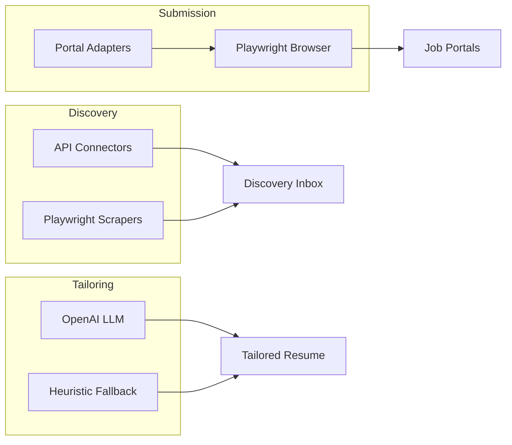

# Automation Setup

Configure job discovery scraping, LLM tailoring, and batch auto-apply for the Job Seeker Automation App.

## Prerequisites

- Application installed and database initialized — see [GETTING_STARTED.md](../01-getting-started/GETTING_STARTED.md)
- Playwright installed: `playwright install chromium` (or `PLAYWRIGHT_CHANNEL=chrome`)
- Admin access — see [ADMIN_GUIDE.md](ADMIN_GUIDE.md)

## Overview

The automation stack has three independent layers:



Each layer can be enabled independently. All automation defaults to **disabled**.

## Step 1: Credential Encryption Key

Required before storing any portal credentials.

```bash
python -c "from cryptography.fernet import Fernet; print(Fernet.generate_key().decode())"
```

Add to `.env`:
```env
CREDENTIAL_ENCRYPTION_KEY=<generated-key>
```

Restart the application after setting. Without this key, credentials are encrypted with an ephemeral key and lost on restart.

## Step 2: Playwright Setup

### Install browser

```bash
pip install -r requirements/requirements-jobs.txt
playwright install chromium
```

### macOS: use system Chrome (recommended)

```env
PLAYWRIGHT_CHANNEL=chrome
```

Fixes DNS and rendering issues on some Mac configurations.

### Headless settings

```env
PLAYWRIGHT_HEADLESS=true           # Default for most operations
INDEED_PLAYWRIGHT_HEADLESS=false   # Indeed blocks headless browsers
```

Indeed scrapes and submissions always use a headed browser regardless of `PLAYWRIGHT_HEADLESS`.

## Step 3: API-Based Discovery

These connectors work without browser automation or credentials.

### Adzuna

1. Register at https://developer.adzuna.com/
2. Add to `.env`:
```env
ADZUNA_APP_ID=your-app-id
ADZUNA_APP_KEY=your-app-key
```
3. Enable `adzuna` in search profile sources

### Remotive, Greenhouse, Lever, RSS

No global configuration needed. Configure per search profile:
- **Remotive** — Enable `remotive` source
- **Greenhouse** — Add board slugs (e.g. `["stripe", "airbnb"]`)
- **Lever** — Add board slugs (e.g. `["netflix"]`)
- **RSS** — Add feed URLs

### Rate limiting

```env
DISCOVERY_RATE_LIMIT_PER_HOUR=100
```

## Step 4: Browser-Based Discovery (LinkedIn, Indeed)

### Export portal sessions

Run locally with a visible browser:

```bash
# LinkedIn
python scripts/export_playwright_storage.py linkedin

# Indeed
python scripts/export_playwright_storage.py indeed

# Custom output path
python scripts/export_playwright_storage.py linkedin linkedin_storage_state.json
```

**What happens:**
1. Opens portal home page in Chrome
2. Waits for you to log in manually
3. Detects session cookies (`li_at` for LinkedIn; `PPID`/`CTK` for Indeed)
4. Saves JSON with `storage_state` and `user_agent`

### Store credentials

1. Log in to the app
2. Navigate to `/apply/credentials`
3. Select portal type
4. Paste the full JSON from the export script
5. Click **Save**
6. Click **Test** to verify session health

### Enable scraping

```env
LINKEDIN_SCRAPE_ENABLED=true
INDEED_SCRAPE_ENABLED=true
```

Add `linkedin` and/or `indeed` to search profile sources.

### Scrape rate limits

```env
SCRAPE_RATE_LIMIT_PER_HOUR=20
SCRAPE_DELAY_MIN_MS=2000
SCRAPE_DELAY_MAX_MS=6000
SCRAPE_USE_REDIS=false    # false | true | auto
```

| `SCRAPE_USE_REDIS` | Behavior |
|---------------------|----------|
| `false` | In-memory rate limits (default for local dev) |
| `true` | Always use Redis |
| `auto` | Use Redis only when `CELERY_BROKER_URL` is set |

## Step 5: LLM Tailoring

### OpenAI configuration

```env
OPENAI_API_KEY=sk-...
OPENAI_MODEL=gpt-4o-mini
```

### What LLM enables

- Nuanced bullet rephrasing for keyword inclusion
- Context-aware cover letter generation
- Better summary variant selection

### Without API key

Heuristic fallbacks activate automatically:
- Simple keyword insertion in bullets
- Template-based cover letters
- Keyword overlap for summary selection

No configuration needed for fallback mode.

## Step 6: Auto-Apply (Optional)

All auto-apply flags default to `false`. Enable only after testing credentials and manual submission.

### Enable flags

```env
APPLY_AUTOMATION_ENABLED=true        # Greenhouse, Lever
LINKEDIN_AUTO_APPLY_ENABLED=true     # LinkedIn Easy Apply
INDEED_AUTO_APPLY_ENABLED=true       # Indeed Apply
DAILY_APPLY_CAP=25
```

### Portal support

| Portal | Flag | Method |
|--------|------|--------|
| Greenhouse | `APPLY_AUTOMATION_ENABLED` | API adapter |
| Lever | `APPLY_AUTOMATION_ENABLED` | API adapter |
| LinkedIn | `LINKEDIN_AUTO_APPLY_ENABLED` | Playwright Easy Apply |
| Indeed | `INDEED_AUTO_APPLY_ENABLED` | Playwright Apply |
| Other | — | Generic adapter (marks needs_manual) |

### Testing before enabling

1. Store and test portal credentials
2. Submit one application manually through the app
3. Verify submission proof screenshot
4. Enable auto-apply flag for that portal only
5. Create a small batch (1–2 applications) and approve
6. Monitor results before scaling up

## Step 7: Celery (Production)

For scheduled discovery and background batch submission.

### Docker Compose (included)

```bash
docker compose up --build
```

Services: `web`, `db`, `redis`, `celery_worker`, `celery_beat`

### Manual Celery setup

```env
CELERY_BROKER_URL=redis://localhost:6379/0
CELERY_RESULT_BACKEND=redis://localhost:6379/0
```

```bash
celery -A celery_app.celery worker --loglevel=info -Q scraping,default
celery -A celery_app.celery beat --loglevel=info
```

### Celery tasks

| Task | Queue | Trigger |
|------|-------|---------|
| `run_all_active_discoveries` | scraping | Celery beat every 6h (`run-active-job-discoveries`) |
| `run_discovery_for_profile` | scraping | Manual / programmatic |
| `batch_tailor_applications` | default | User batch tailor action |
| `submit_apply_batch` | scraping | User batch approve action |

### Verify scheduled discovery

With Redis + worker + beat running:

```bash
# Force one scheduled discovery pass now
celery -A celery_app.celery call app.tasks.job_tasks.run_all_active_discoveries
```

Expect `{'success': True, 'profiles_run': N}` where `N` is active profiles whose `last_run_at` is older than their `schedule_hours` (or never run). Check worker logs and Discovery Inbox for new items.

### Local dev without Celery

Discovery and tailoring run synchronously in the Flask process when you click action buttons. No Redis or Celery required.

## Environment Variable Reference

| Variable | Default | Purpose |
|----------|---------|---------|
| `CREDENTIAL_ENCRYPTION_KEY` | (empty) | Fernet key for portal sessions |
| `ADZUNA_APP_ID` | (empty) | Adzuna API app ID |
| `ADZUNA_APP_KEY` | (empty) | Adzuna API key |
| `DISCOVERY_RATE_LIMIT_PER_HOUR` | 100 | API discovery rate limit |
| `OPENAI_API_KEY` | (empty) | LLM tailoring and cover letters |
| `OPENAI_MODEL` | gpt-4o-mini | OpenAI model selection |
| `PLAYWRIGHT_HEADLESS` | true | Headless browser mode |
| `PLAYWRIGHT_CHANNEL` | chrome | Use system Chrome |
| `INDEED_PLAYWRIGHT_HEADLESS` | false | Indeed requires headed browser |
| `LINKEDIN_SCRAPE_ENABLED` | false | Enable LinkedIn discovery |
| `INDEED_SCRAPE_ENABLED` | false | Enable Indeed discovery |
| `SCRAPE_RATE_LIMIT_PER_HOUR` | 20 | Browser scrape rate limit |
| `SCRAPE_DELAY_MIN_MS` | 2000 | Min delay between scrapes |
| `SCRAPE_DELAY_MAX_MS` | 6000 | Max delay between scrapes |
| `SCRAPE_USE_REDIS` | false | Redis-backed rate limiting |
| `APPLY_AUTOMATION_ENABLED` | false | Greenhouse/Lever auto-apply |
| `LINKEDIN_AUTO_APPLY_ENABLED` | false | LinkedIn auto-apply |
| `INDEED_AUTO_APPLY_ENABLED` | false | Indeed auto-apply |
| `DAILY_APPLY_CAP` | 25 | Max submissions per day |

Full reference: [CONFIGURATION.md](CONFIGURATION.md)

## Verification Checklist

- [ ] `CREDENTIAL_ENCRYPTION_KEY` set and app restarted
- [ ] Playwright installed (`playwright install chromium`)
- [ ] API discovery sources configured (Adzuna keys if using)
- [ ] Portal sessions exported and stored (if using LinkedIn/Indeed)
- [ ] Scraping flags enabled (if using browser discovery)
- [ ] LLM API key set (if using AI tailoring)
- [ ] Auto-apply tested with single application before batch
- [ ] Celery worker running (if using Docker/production)
- [ ] Daily cap configured appropriately

See [FIRST_RUN_CHECKLIST.md](../01-getting-started/FIRST_RUN_CHECKLIST.md) for post-install verification.

## Related Docs

- [ADMIN_GUIDE.md](ADMIN_GUIDE.md) — Full admin reference
- [CONFIGURATION.md](CONFIGURATION.md) — All environment variables
- [SCRAPING_AND_AUTOMATION.md](../03-development/SCRAPING_AND_AUTOMATION.md) — Developer guide
- [BATCH_AUTO_APPLY.md](../02-user-guide/BATCH_AUTO_APPLY.md) — User guide for batches
- [TROUBLESHOOTING.md](TROUBLESHOOTING.md) — Automation issues
