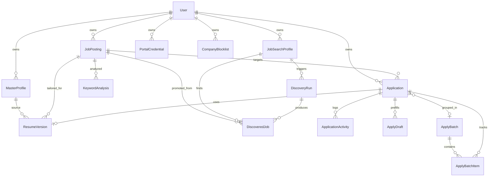

# Job Seeker Data Model

Reference for all tables in the `jobs` schema (PostgreSQL) or equivalent SQLite tables. Source: [`app/models/jobs.py`](../../app/models/jobs.py).

## Prerequisites

- Basic understanding of the application workflow — see [WORKFLOW.md](../02-user-guide/WORKFLOW.md)
- Database setup — see [GETTING_STARTED.md](../01-getting-started/GETTING_STARTED.md)

## Schema Organization

| Database | Schema | Tables |
|----------|--------|--------|
| PostgreSQL | `jobs` | All job seeker tables |
| SQLite | (default) | Same table names, no schema prefix |

All job seeker tables reference `auth.users` (PostgreSQL) or `users` (SQLite) via `user_id`.

## Entity Relationship Diagram



## Enums

### ApplicationStage

Pipeline stage for an application.

| Value | Description |
|-------|-------------|
| `saved` | Application created; not yet tailored |
| `tailoring` | Tailoring in progress or awaiting review |
| `ready_to_apply` | Resume approved; apply draft ready |
| `applied` | Submitted to employer |
| `phone_screen` | Phone screen scheduled or completed |
| `interview` | Interview stage |
| `offer` | Offer received |
| `rejected` | Rejected by employer |
| `withdrawn` | Withdrawn by candidate |

### ResumeVersionStatus

| Value | Description |
|-------|-------------|
| `draft` | Initial version |
| `pending_approval` | Tailored; awaiting user review |
| `approved` | User approved for submission |
| `archived` | Superseded or discarded |

### JobSource

Where a job posting originated.

| Value | Description |
|-------|-------------|
| `manual` | Pasted by user |
| `url` | Fetched from URL |
| `rss` | RSS feed |
| `api` | Generic API |
| `greenhouse` | Greenhouse board |
| `lever` | Lever board |
| `ashby` | Ashby board |
| `adzuna` | Adzuna API |
| `remotive` | Remotive API |
| `linkedin` | LinkedIn scrape |
| `indeed` | Indeed scrape |

### DiscoveredJobStatus

| Value | Description |
|-------|-------------|
| `new` | In discovery inbox |
| `accepted` | Promoted to JobPosting |
| `skipped` | User dismissed |
| `duplicate` | Matched existing posting |

### ApplyBatchStatus

| Value | Description |
|-------|-------------|
| `draft` | Created; not yet approved |
| `approved` | User approved; queued for submission |
| `running` | Celery worker submitting |
| `completed` | All items processed |
| `partial_failure` | Some items failed |

### SubmissionStatus

Per-application portal submission result.

| Value | Description |
|-------|-------------|
| `pending` | Queued |
| `submitted` | Successfully submitted |
| `needs_manual` | Requires manual intervention |
| `failed` | Submission error |

### PortalType

| Value | Description |
|-------|-------------|
| `greenhouse` | Greenhouse ATS |
| `lever` | Lever ATS |
| `ashby` | Ashby ATS |
| `linkedin` | LinkedIn Easy Apply |
| `indeed` | Indeed Apply |
| `generic` | Fallback adapter |

---

## Tables

### master_profiles

Canonical structured resume per user. One active profile drives tailoring and keyword analysis.

| Column | Type | Description |
|--------|------|-------------|
| `id` | ID | Primary key |
| `user_id` | FK → users | Owner |
| `headline` | String(255) | Professional headline |
| `profile_data` | JSON/JSONB | Structured resume (contact, experience, education, skills) |
| `source_filename` | String(255) | Original upload filename |
| `source_type` | String(20) | `pdf`, `docx`, or `manual` |
| `is_active` | Boolean | Active profile flag (one per user) |
| `parse_confidence` | Numeric(5,2) | Parser confidence score |
| `notes` | Text | User notes |
| `created_at`, `updated_at` | DateTime | Timestamps |
| `is_deleted`, `deleted_at` | Boolean, DateTime | Soft delete |

**profile_data structure:**

```json
{
  "contact": {"name": "", "email": "", "phone": "", "location": "", "linkedin": ""},
  "headline": "",
  "summary": "",
  "summary_variants": [{"text": ""}],
  "experience": [{"title": "", "company": "", "start": "", "end": "", "bullets": [{"text": ""}]}],
  "education": [{"institution": "", "degree": "", "end": ""}],
  "skills": {"technical": [], "certifications": []}
}
```

### job_postings

Saved job from manual entry, URL fetch, or discovery promotion.

| Column | Type | Description |
|--------|------|-------------|
| `id` | ID | Primary key |
| `user_id` | FK → users | Owner |
| `title` | String(255) | Job title |
| `company` | String(255) | Company name |
| `description` | Text | Full job description |
| `requirements` | Text | Requirements section |
| `location` | String(255) | Location |
| `remote_type` | String(50) | `remote`, `hybrid`, `onsite` |
| `salary_min`, `salary_max` | Numeric(12,2) | Salary range |
| `salary_currency` | String(3) | Default `USD` |
| `url` | String(1024) | Application or listing URL |
| `source` | String(50) | JobSource value |
| `source_id` | String(255) | External ID for deduplication |
| `seniority` | String(50) | Seniority level |
| `extracted_keywords` | JSON/JSONB | Keywords extracted from JD |
| `fit_score` | Integer | 0–100 fit score vs active profile |
| `is_active` | Boolean | Active posting |
| `posted_at` | DateTime | Original post date |
| `notes` | Text | User notes |

### job_search_profiles

Automated discovery criteria.

| Column | Type | Description |
|--------|------|-------------|
| `id` | ID | Primary key |
| `user_id` | FK → users | Owner |
| `name` | String(255) | Profile name |
| `titles` | JSON/JSONB | Target job titles |
| `locations` | JSON/JSONB | Target locations |
| `remote_preference` | String(50) | `any`, `remote`, `hybrid`, `onsite` |
| `seniority_levels` | JSON/JSONB | e.g. `["senior", "staff"]` |
| `min_fit_score` | Integer | Minimum fit score to show in inbox (default 50) |
| `salary_floor` | Numeric(12,2) | Minimum salary filter |
| `keywords_include` | JSON/JSONB | Required keywords |
| `keywords_exclude` | JSON/JSONB | Excluded keywords |
| `sources` | JSON/JSONB | Enabled connectors: `adzuna`, `remotive`, `greenhouse`, `lever`, `rss`, `indeed`, `linkedin` |
| `greenhouse_boards` | JSON/JSONB | Greenhouse board slugs |
| `lever_boards` | JSON/JSONB | Lever board slugs |
| `rss_feeds` | JSON/JSONB | RSS feed URLs |
| `indeed_max_age_days` | Integer | Indeed listing age filter (default 7) |
| `indeed_radius_miles` | Integer | Indeed location radius |
| `schedule_hours` | Integer | Hours between scheduled runs (default 6) |
| `is_active` | Boolean | Active profile |
| `last_run_at` | DateTime | Last discovery run timestamp |

### discovered_jobs

Staging records in the discovery inbox before promotion.

| Column | Type | Description |
|--------|------|-------------|
| `id` | ID | Primary key |
| `user_id` | FK → users | Owner |
| `search_profile_id` | FK → job_search_profiles | Source search profile |
| `discovery_run_id` | FK → discovery_runs | Source run |
| `title`, `company` | String | Job identifiers |
| `description` | Text | Job description snippet |
| `location` | String(255) | Location |
| `url` | String(1024) | Listing URL |
| `source` | String(50) | Connector source |
| `source_id` | String(255) | External dedup key |
| `fit_score` | Integer | Fit score at discovery time |
| `status` | String(50) | DiscoveredJobStatus value |
| `job_posting_id` | FK → job_postings | Set when accepted |
| `raw_data` | JSON/JSONB | Raw connector payload |

### discovery_runs

Audit log for each connector execution.

| Column | Type | Description |
|--------|------|-------------|
| `id` | ID | Primary key |
| `user_id` | FK → users | Owner |
| `search_profile_id` | FK → job_search_profiles | Parent profile |
| `source` | String(50) | Connector name |
| `status` | String(50) | `running`, `completed`, `failed` |
| `jobs_found` | Integer | Total jobs returned |
| `jobs_new` | Integer | New (non-duplicate) jobs |
| `error_message` | Text | Error details if failed |
| `run_metadata` | JSON/JSONB | Connector-specific metadata |
| `completed_at` | DateTime | Completion timestamp |

### company_blocklists

Companies or URL patterns to skip during discovery.

| Column | Type | Description |
|--------|------|-------------|
| `id` | ID | Primary key |
| `user_id` | FK → users | Owner |
| `company_name` | String(255) | Company to block |
| `url_pattern` | String(512) | URL pattern to block |
| `reason` | String(255) | Why blocked |

### applications

Tracks a user's pursuit of a specific job posting.

| Column | Type | Description |
|--------|------|-------------|
| `id` | ID | Primary key |
| `user_id` | FK → users | Owner |
| `job_posting_id` | FK → job_postings | Target job |
| `resume_version_id` | FK → resume_versions | Approved tailored resume |
| `stage` | String(50) | ApplicationStage value |
| `applied_at` | DateTime | Submission timestamp |
| `response_at` | DateTime | Employer response timestamp |
| `recruiter_name`, `recruiter_email` | String | Contact info |
| `portal_url` | String(1024) | Application portal URL |
| `keyword_coverage_at_apply` | Numeric(5,2) | Coverage % at apply time |
| `notes` | Text | User notes |
| `submission_status` | String(50) | SubmissionStatus value |
| `submission_proof` | String(1024) | Screenshot or proof path |
| `submission_error` | Text | Submission error message |
| `apply_batch_id` | FK → apply_batches | Batch if auto-submitted |
| `follow_up_at` | DateTime | Follow-up reminder date |
| `custom_fields` | JSON/JSONB | User-defined fields |

### resume_versions

Per-job tailored resume derived from master profile.

| Column | Type | Description |
|--------|------|-------------|
| `id` | ID | Primary key |
| `user_id` | FK → users | Owner |
| `master_profile_id` | FK → master_profiles | Source profile |
| `job_posting_id` | FK → job_postings | Target job |
| `version_number` | Integer | Version counter |
| `status` | String(50) | ResumeVersionStatus value |
| `tailored_data` | JSON/JSONB | Tailored profile structure |
| `diff_log` | JSON/JSONB | Change audit trail |
| `ats_score` | Numeric(5,2) | ATS parse-test score |
| `keyword_coverage` | Numeric(5,2) | Keyword match % |
| `export_filename` | String(255) | Generated DOCX filename |
| `approved_at` | DateTime | Approval timestamp |
| `approved_by` | FK → users | Approving user |

### keyword_analyses

Snapshot of JD keyword coverage vs master profile.

| Column | Type | Description |
|--------|------|-------------|
| `id` | ID | Primary key |
| `user_id` | FK → users | Owner |
| `job_posting_id` | FK → job_postings | Analyzed job |
| `master_profile_id` | FK → master_profiles | Compared profile |
| `jd_keywords` | JSON/JSONB | Keywords from job description |
| `matched_keywords` | JSON/JSONB | Keywords found in profile |
| `missing_keywords` | JSON/JSONB | Keywords not in profile |
| `synonym_matches` | JSON/JSONB | Synonym-based matches |
| `coverage_score` | Numeric(5,2) | Coverage percentage |
| `analysis_metadata` | JSON/JSONB | Additional analysis data |

### apply_drafts

Pre-filled application form awaiting user review.

| Column | Type | Description |
|--------|------|-------------|
| `id` | ID | Primary key |
| `application_id` | FK → applications | Parent application |
| `user_id` | FK → users | Owner |
| `form_fields` | JSON/JSONB | Pre-filled form field values |
| `cover_letter` | Text | Cover letter draft |
| `status` | String(50) | `draft`, `ready`, `submitted` |
| `submitted_at` | DateTime | Submission timestamp |
| `notes` | Text | User notes |

### apply_batches

Group of applications approved for automated portal submission.

| Column | Type | Description |
|--------|------|-------------|
| `id` | ID | Primary key |
| `user_id` | FK → users | Owner |
| `status` | String(50) | ApplyBatchStatus value |
| `application_ids` | JSON/JSONB | List of application IDs |
| `approved_at` | DateTime | User approval timestamp |
| `completed_at` | DateTime | Batch completion timestamp |
| `notes` | Text | User notes |
| `batch_metadata` | JSON/JSONB | Batch-level metadata |

### apply_batch_items

Per-application progress within a batch.

| Column | Type | Description |
|--------|------|-------------|
| `id` | ID | Primary key |
| `batch_id` | FK → apply_batches | Parent batch |
| `application_id` | FK → applications | Target application |
| `status` | String(50) | `pending`, `running`, `completed`, `failed` |
| `submission_status` | String(50) | SubmissionStatus value |
| `error_message` | Text | Error details |
| `proof_path` | String(1024) | Screenshot proof path |

### application_activities

Timeline events for an application.

| Column | Type | Description |
|--------|------|-------------|
| `id` | ID | Primary key |
| `application_id` | FK → applications | Parent application |
| `user_id` | FK → users | Acting user |
| `activity_type` | String(50) | e.g. `tailored`, `approved`, `submitted`, `note` |
| `subject` | String(255) | Short summary |
| `description` | Text | Full description |
| `activity_metadata` | JSON/JSONB | Additional context |

### portal_credentials

Encrypted portal session data for auto-apply and scraping.

| Column | Type | Description |
|--------|------|-------------|
| `id` | ID | Primary key |
| `user_id` | FK → users | Owner |
| `portal` | String(50) | PortalType value |
| `label` | String(255) | User-friendly label |
| `encrypted_data` | Text | Fernet-encrypted session JSON |
| `expires_at` | DateTime | Session expiry |
| `is_active` | Boolean | Active credential |
| `last_used_at` | DateTime | Last use timestamp |

---

## Key Relationships

| From | To | Cardinality | Notes |
|------|----|-------------|-------|
| User | MasterProfile | 1:N | One active profile recommended |
| MasterProfile | ResumeVersion | 1:N | One per tailoring run |
| JobPosting | Application | 1:N | Usually one application per user per job |
| Application | ResumeVersion | N:1 | Set after tailoring approval |
| Application | ApplyDraft | 1:N | Latest draft used for review |
| JobSearchProfile | DiscoveredJob | 1:N | Via discovery runs |
| DiscoveredJob | JobPosting | N:1 | Set on accept |
| ApplyBatch | ApplyBatchItem | 1:N | One item per application |

## Database Initialization

```bash
python scripts/init_database.py      # auth + core jobs tables
python scripts/create_jobs_schema.py # discovery, credentials, batches
```

See [GETTING_STARTED.md](../01-getting-started/GETTING_STARTED.md) for full setup.

## Related Docs

- [ATS_EXPORT_RULES.md](ATS_EXPORT_RULES.md) — Resume export constraints
- [JOB_SEEKER_SERVICES.md](../02-architecture/JOB_SEEKER_SERVICES.md) — Service layer
- [DATABASE_SCHEMAS.md](DATABASE_SCHEMAS.md) — Full database structure including auth schema
- [WORKFLOW.md](../02-user-guide/WORKFLOW.md) — How data flows through the UI
